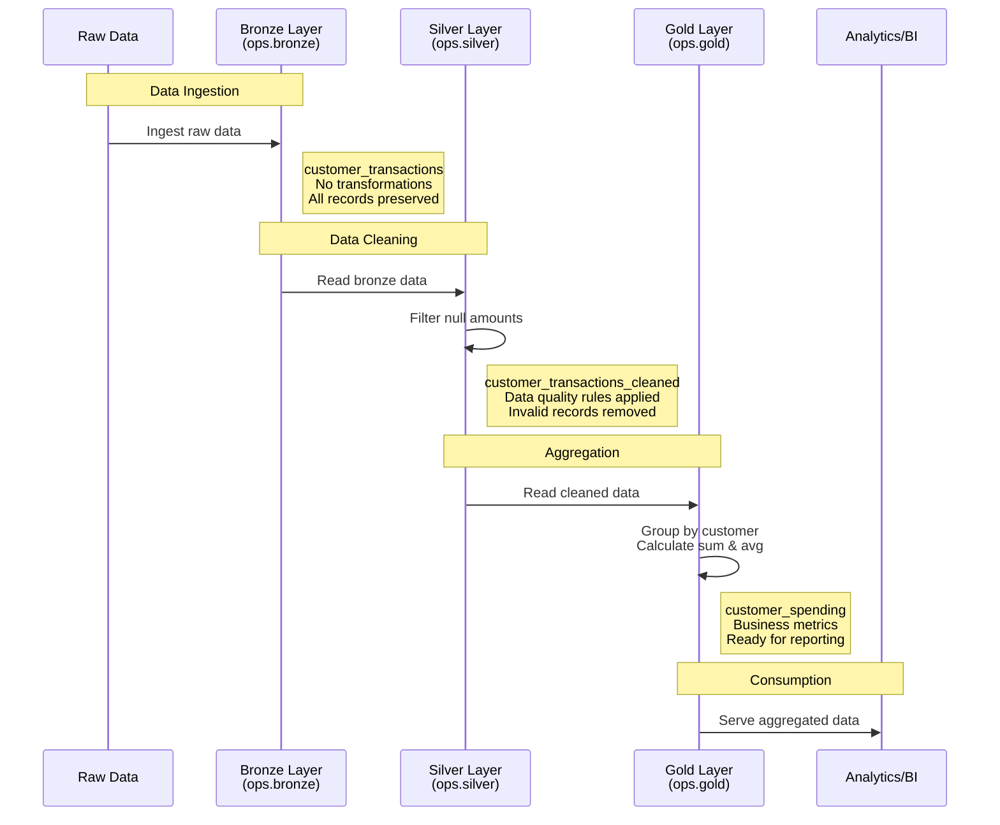

# Simple Medallion Architecture

A demonstration of the medallion architecture pattern in Databricks, implementing Bronze, Silver, and Gold data layers using Delta Lake.

## Overview

This project showcases a three-layer data processing pipeline following the medallion architecture pattern:

- **Bronze Layer**: Raw data ingestion with minimal transformation
- **Silver Layer**: Cleaned and validated data
- **Gold Layer**: Business-level aggregations ready for analytics

## Architecture



## Data Flow

### 1. Bronze Layer (`ops.bronze.customer_transactions`)
**Purpose**: Raw data ingestion

- Ingests raw customer transaction data
- No transformations applied
- Preserves all records including those with null values
- Schema: `id`, `name`, `date`, `amount`

### 2. Silver Layer (`ops.silver.customer_transactions_cleaned`)
**Purpose**: Data quality and cleaning

- Reads from Bronze layer
- Filters out records with null amounts
- Ensures data quality for downstream processing
- Schema: `id`, `name`, `date`, `amount` (cleaned)

### 3. Gold Layer (`ops.gold.customer_spending`)
**Purpose**: Business-level aggregations

- Reads from Silver layer
- Groups by customer name
- Calculates:
  - `total_spent`: Sum of all transactions per customer
  - `average_spent`: Average transaction amount per customer
- Schema: `name`, `total_spent`, `average_spent`

## Project Structure

```
data-101/
├── simple_medallion_architecture.ipynb  # Main notebook implementing the pipeline
└── README.md                            # This file
```

## Unity Catalog Structure

```
ops (catalog)
├── bronze (schema)
│   └── customer_transactions
├── silver (schema)
│   └── customer_transactions_cleaned
└── gold (schema)
    └── customer_spending
```

## Notebook Cells

1. **Cell 1**: Import required libraries (`pyspark.sql.functions`)
2. **Cell 2**: Create Bronze layer with sample data
3. **Cell 3**: Transform Bronze → Silver (data cleaning)
4. **Cell 4**: Transform Silver → Gold (aggregation)
5. **Cell 5**: Display final Gold layer results

## Prerequisites

- Databricks workspace with Unity Catalog enabled
- Permissions to create catalogs and schemas
- Serverless or cluster compute with Spark support

## Running the Pipeline

1. Open `simple_medallion_architecture.ipynb`
2. Run all cells in sequence (cells must be executed in order)
3. The pipeline will:
   - Create the `ops` catalog and required schemas
   - Ingest sample data into Bronze
   - Clean data and write to Silver
   - Aggregate data and write to Gold
   - Display final results

## Sample Data

The notebook uses sample customer transaction data:

| id | name        | date       | amount |
|----|-------------|------------|--------|
| 1  | John Doe    | 2025-09-09 | 100.0  |
| 2  | Jane Smith  | 2025-09-08 | 150.0  |
| 3  | Sam Brown   | 2025-09-07 | NULL   |

## Expected Output

Final Gold layer aggregation:

| name       | total_spent | average_spent |
|------------|-------------|---------------|
| John Doe   | 100.0       | 100.0         |
| Jane Smith | 150.0       | 150.0         |

*Note: Sam Brown is filtered out in the Silver layer due to null amount*

## Key Features

- **Idempotent**: Uses `CREATE IF NOT EXISTS` for schemas and `mode("overwrite")` for tables
- **Delta Lake**: All tables use Delta format for ACID transactions
- **Modular**: Each layer is independent and can be modified without affecting others
- **Scalable**: Pattern scales from sample data to production workloads

## Best Practices Demonstrated

1. **Separation of Concerns**: Each layer has a distinct purpose
2. **Data Quality**: Silver layer enforces quality rules
3. **Schema Evolution**: Delta Lake supports schema changes over time
4. **Lineage**: Clear data flow from Bronze → Silver → Gold
5. **Unity Catalog**: Organized namespace with catalog and schemas

## Extensions & Next Steps

- Add incremental processing with Delta Lake merge operations
- Implement data quality checks with expectations
- Add timestamp columns for audit trails
- Create downstream dashboards and reports
- Implement error handling and logging
- Add unit tests for transformation logic

## References

- [Medallion Architecture](https://www.databricks.com/glossary/medallion-architecture)
- [Delta Lake Documentation](https://docs.delta.io/)
- [Unity Catalog Guide](https://docs.databricks.com/data-governance/unity-catalog/index.html)

## License

This is a demonstration project for learning purposes.
