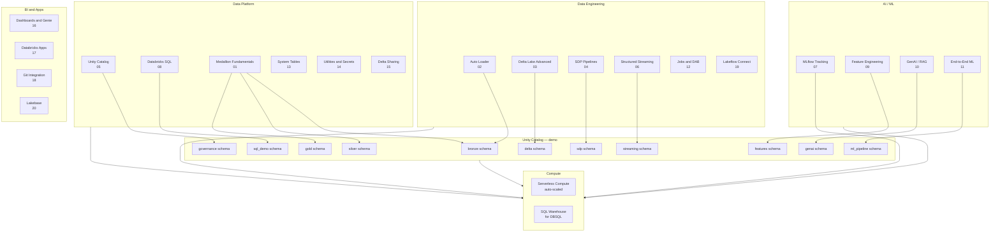
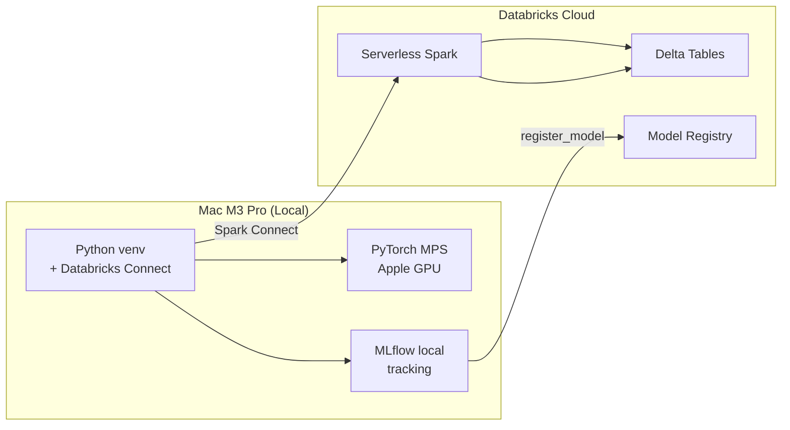

# Databricks Data Engineering — Comprehensive Use Cases

A hands-on learning resource for the Databricks platform covering Data Engineering, SQL, AI/ML, Governance, and GenAI. Each module is a self-contained notebook with runnable source code and conceptual documentation.

> **This repo is for learning only** — not a production template. The docs are conceptual references, not business scenarios.

## Use Cases Overview

| # | Module | Databricks Features | Level |
|---|--------|-------------------|-------|
| 01 | [01-medallion-fundamentals](01-medallion-fundamentals/simple_medallion_architecture) | Medallion Architecture, Delta Lake, Unity Catalog | Beginner |
| 02 | [02-auto-loader](02-auto-loader/auto_loader_streaming) | Auto Loader, cloudFiles, schema inference & evolution, checkpointing, foreachBatch + MERGE | Intermediate |
| 03 | [03-delta-advanced](03-delta-advanced/delta_advanced_features) | Delta MERGE, SCD Type 2, Change Data Feed, Time Travel, OPTIMIZE/ZORDER, VACUUM, Deletion Vectors | Advanced |
| 04 | [04-sdp-pipelines](04-sdp-pipelines/sdp_medallion_pipeline) | Spark Declarative Pipelines (SDP), @dlt expectations, streaming tables, materialized views | Advanced |
| 05 | [05-uc-governance](05-uc-governance/uc_governance_demo) | Unity Catalog, GRANT/REVOKE, tags, row-level security, column masking, audit logs, lineage | Advanced |
| 06 | [06-structured-streaming](06-structured-streaming/structured_streaming_demo) | Structured Streaming, watermarks, windowed aggregations, deduplication, stream-stream joins, foreachBatch | Advanced |
| 07 | [07-mlflow-tracking](07-mlflow-tracking/mlflow_tracking_demo) | MLflow tracking, autologging, hyperparameter tuning, Model Registry, model serving | Intermediate |
| 08 | [08-databricks-sql](08-databricks-sql/databricks_sql_features) | Views, Materialized Views, Window Functions, CTEs, PIVOT, Delta SQL, AI Functions, Liquid Clustering | Intermediate |
| 09 | [09-feature-engineering](09-feature-engineering/feature_store_demo) | Feature Store, FeatureLookup, point-in-time joins, create_training_set, score_batch, model logging | Advanced |
| 10 | [10-genai-rag](10-genai-rag/genai_rag_demo) | AI Functions (SQL), Vector Search, embeddings, RAG pipeline, LLM serving, AI Gateway, Agent Bricks | Advanced |
| 11 | [11-end-to-end-ml-pipeline](11-end-to-end-ml-pipeline/end_to_end_ml_pipeline) | End-to-end: data → features → train → MLflow → registry → serving. Includes Mac M3 Pro local dev via Databricks Connect + PyTorch MPS | Advanced |
| 12 | [12-jobs-orchestration-dab](12-jobs-orchestration-dab/jobs_orchestration_dab) | Lakeflow Jobs, multi-task workflows, scheduling, triggers, Declarative Automation Bundles (DAB), CI/CD patterns | Advanced |
| 13 | [13-system-tables-monitoring](13-system-tables-monitoring/system_tables_monitoring) | system.billing, system.compute, system.access, system.query, system.lakeflow, data quality monitoring, SQL alerts | Advanced |
| 14 | [14-notebook-utilities-secrets](14-notebook-utilities-secrets/notebook_utilities_secrets) | dbutils.fs, dbutils.widgets, dbutils.secrets, %run, dbutils.notebook.run, library management, notebook context | Intermediate |
| 15 | [15-delta-sharing](15-delta-sharing/delta_sharing_demo) | Delta Sharing: shares, recipients, OPEN vs D2D, cross-org data access, provider/recipient patterns | Advanced |
| 16 | [16-dashboards-alerts-genie](16-dashboards-alerts-genie/dashboards_alerts_genie) | Lakeview dashboards, SQL alerts, Genie spaces (natural language Q&A), AI/BI | Intermediate |
| 17 | [17-databricks-apps](17-databricks-apps/databricks_apps_demo) | Databricks Apps: Streamlit, Flask, app.yaml, deployment, SDK management, serverless runtime | Advanced |
| 18 | [18-git-integration](18-git-integration/git_integration_demo) | Git folders, branch management, Git CLI, SDK API, CI/CD with DAB, GitHub Actions | Intermediate |
| 19 | [19-lakeflow-connect](19-lakeflow-connect/lakeflow_connect_demo) | Lakeflow Connect: managed ingestion from Salesforce, MySQL, PostgreSQL, Google Ads, HubSpot, ServiceNow | Advanced |
| 20 | [20-lakebase](20-lakebase/lakebase_demo) | Lakebase: managed PostgreSQL, projects, branches, autoscaling endpoints, Data API, reverse ETL to Delta Lake | Advanced |

## Documentation

Conceptual reference docs — not scenario walkthroughs. Read these before diving into the notebooks.

| Doc | Description |
|-----|-------------|
| [Medallion Architecture](docs/medallion-architecture.md) | Bronze/Silver/Gold pattern — layers, quality tiers, component & UML class diagrams, anti-patterns |
| [Data Engineering Concepts](docs/data-engineering-concepts.md) | ETL/ELT, idempotency, data quality, lineage, incremental processing, streaming patterns, orchestration |
| [Databricks Platform Overview](docs/databricks-platform-overview.md) | Compute, storage, governance, AI/ML components, UML class diagram, learning path flowchart |

## Coverage Matrix

### Databricks Platform Features

| Feature | Module | Status |
|---------|--------|--------|
| Medallion Architecture (Bronze/Silver/Gold) | 01 | ✅ Covered |
| Delta Lake (ACID, schema evolution, merge) | 01, 03 | ✅ Covered |
| Delta Lake Advanced (CDF, Time Travel, SCD2, VACUUM) | 03 | ✅ Covered |
| Auto Loader (file ingestion, schema inference) | 02 | ✅ Covered |
| Structured Streaming (watermarks, windows, joins) | 06 | ✅ Covered |
| Spark Declarative Pipelines (SDP / @dlt) | 04 | ✅ Covered |
| Unity Catalog (governance, tags, RLS, masks) | 05 | ✅ Covered |
| Databricks SQL (views, MV, window functions, CTEs) | 08 | ✅ Covered |
| AI Functions in SQL (ai_query, ai_forecast) | 08, 10 | ✅ Covered |
| Liquid Clustering & OPTIMIZE/ZORDER | 03, 08 | ✅ Covered |
| Deletion Vectors | 03 | ✅ Covered |
| MLflow (tracking, autologging, registry) | 07, 11 | ✅ Covered |
| Feature Store / Feature Engineering | 09, 11 | ✅ Covered |
| Model Serving (reference) | 07, 11 | ✅ Covered |
| Vector Search & RAG | 10 | ✅ Covered |
| LLM Serving & AI Gateway | 10 | ✅ Covered |
| Agent Bricks (reference) | 10 | ✅ Covered |
| End-to-End ML Pipeline | 11 | ✅ Covered |
| Databricks Connect (local dev, Mac M3 Pro) | 11 | ✅ Covered |
| PyTorch with Apple MPS (Mac M3 Pro) | 11 | ✅ Covered |
| Lakeflow Jobs (orchestration) | 12 | ✅ Covered |
| Declarative Automation Bundles (DAB) | 12 | ✅ Covered |
| Delta Sharing (cross-org data sharing) | 15 | ✅ Covered |
| Lakeflow Connect (managed ingestion) | 19 | ✅ Covered |
| Data Quality Monitoring / Lakehouse Monitoring | 13 | ✅ Covered |
| SQL Alerts | 13 | ✅ Covered |
| Genie Spaces | 16 | ✅ Covered |
| Lakeview Dashboards | 16 | ✅ Covered |
| Databricks Apps | 17 | ✅ Covered |
| System Tables (billing, audit, query history) | 13 | ✅ Covered |
| Notebook Utilities (dbutils, widgets, %run) | 14 | ✅ Covered |
| Secrets Management | 14 | ✅ Covered |
| Git Integration | 18 | ✅ Covered |
| Lakebase (Postgres autoscaling) | 20 | ✅ Covered |

### Data Engineering Topics

| Topic | Module(s) | Status |
|-------|-----------|--------|
| ETL / ELT patterns | 01, 02 | ✅ Covered |
| Idempotency (MERGE, overwrite) | 02, 03 | ✅ Covered |
| Data quality enforcement | 04, 03 | ✅ Covered |
| Incremental processing | 02, 03 | ✅ Covered |
| Change Data Capture (CDC) | 03 | ✅ Covered |
| Slowly Changing Dimensions (SCD Type 2) | 03 | ✅ Covered |
| Streaming deduplication | 06 | ✅ Covered |
| Stream-stream / stream-static joins | 06 | ✅ Covered |
| Schema management & evolution | 02, 03 | ✅ Covered |
| Data governance & security | 05 | ✅ Covered |
| Feature engineering | 09, 11 | ✅ Covered |
| Model training & evaluation | 07, 11 | ✅ Covered |
| Hyperparameter tuning | 07, 11 | ✅ Covered |
| Model registry & lifecycle | 07, 11 | ✅ Covered |
| Local development (Databricks Connect) | 11 | ✅ Covered |
| Workflow orchestration | 12 | ✅ Covered |
| CI/CD with DAB | 12, 18 | ✅ Covered |
| Data pipeline monitoring | 13 | ✅ Covered |

## Architecture — Component Diagram



## Module Dependencies — UML Class Diagram

```mermaid
classDiagram
    class Module01 {
        +create_bronze() void
        +create_silver() void
        +create_gold() void
    }

    class Module02 {
        +auto_loader_ingest() void
        +schema_evolution() void
        +foreachBatch_merge() void
    }

    class Module03 {
        +delta_merge() void
        +scd2() void
        +cdf() DataFrame
        +time_travel() DataFrame
        +optimize() void
        +vacuum() void
    }

    class Module04 {
        +dlt_expect_or_drop() void
        +dlt_expect() void
        +dlt_expect_or_fail() void
        +streaming_table() void
    }

    class Module05 {
        +grant_revoke() void
        +apply_tags() void
        +row_filter() void
        +column_mask() void
        +audit_query() DataFrame
    }

    class Module06 {
        +watermark() void
        +windowed_agg() void
        +deduplicate() void
        +stream_join() void
        +foreachBatch() void
    }

    class Module07 {
        +log_params() void
        +log_metrics() void
        +autolog() void
        +register_model() void
        +load_model() object
    }

    class Module08 {
        +create_view() void
        +materialized_view() void
        +window_functions() void
        +ai_functions() void
        +explain_plan() void
    }

    class Module09 {
        +create_feature_table() void
        +feature_lookup() void
        +create_training_set() DataFrame
        +score_batch() DataFrame
        +log_model_with_features() void
    }

    class Module10 {
        +generate_embeddings() void
        +vector_search() List
        +rag_pipeline() string
        +ai_functions_sql() void
        +llm_serving() void
    }

    class Module11 {
        +ingest_data() void
        +explore_data() void
        +engineer_features() void
        +train_models() void
        +tune_hyperparameters() void
        +register_model() void
        +pytorch_mps_train() void
    }

    Module01 --> Module02 : prerequisites
    Module02 --> Module04 : ingestion for SDP
    Module01 --> Module03 : Delta foundations
    Module03 --> Module06 : CDF for streaming
    Module07 --> Module09 : model lifecycle
    Module07 --> Module10 : MLflow for GenAI
    Module07 --> Module11 : tracking for E2E
    Module08 --> Module10 : AI functions
    Module09 --> Module11 : features for E2E
    Module11 --> Module10 : GenAI integration
    Module05 ..> Module01 : governs all

## Project Structure

```mermaid
flowchart TD
    ROOT[dataengineering/] --> README[README.md<br/>Entry point]
    ROOT --> DOCS[docs/<br/>Documentation]
    ROOT --> M01[01-medallion-fundamentals/]
    ROOT --> M02[02-auto-loader/]
    ROOT --> M03[03-delta-advanced/]
    ROOT --> M04[04-sdp-pipelines/]
    ROOT --> M05[05-uc-governance/]
    ROOT --> M06[06-structured-streaming/]
    ROOT --> M07[07-mlflow-tracking/]
    ROOT --> M08[08-databricks-sql/]
    ROOT --> M09[09-feature-engineering/]
    ROOT --> M10[10-genai-rag/]
    ROOT --> M11[11-end-to-end-ml-pipeline/]
    ROOT --> M12[12-jobs-orchestration-dab/]
    ROOT --> M13[13-system-tables-monitoring/]
    ROOT --> M14[14-notebook-utilities-secrets/]
    ROOT --> M15[15-delta-sharing/]
    ROOT --> M16[16-dashboards-alerts-genie/]
    ROOT --> M17[17-databricks-apps/]
    ROOT --> M18[18-git-integration/]
    ROOT --> M19[19-lakeflow-connect/]
    ROOT --> M20[20-lakebase/]

    DOCS --> D1[medallion-architecture.md]
    DOCS --> D2[data-engineering-concepts.md]
    DOCS --> D3[databricks-platform-overview.md]
```

```
dataengineering/
├── README.md                                    # Entry point + documentation index
├── docs/                                        # Conceptual documentation
│   ├── medallion-architecture.md                # Medallion Architecture guide
│   ├── data-engineering-concepts.md             # Core data engineering principles
│   └── databricks-platform-overview.md           # Platform components overview
├── 01-medallion-fundamentals/
│   └── simple_medallion_architecture.ipynb       # 01 — Bronze/Silver/Gold basics
├── 02-auto-loader/
│   └── auto_loader_streaming.ipynb               # 02 — Auto Loader ingestion
├── 03-delta-advanced/
│   └── delta_advanced_features.ipynb             # 03 — Delta Lake advanced
├── 04-sdp-pipelines/
│   └── sdp_medallion_pipeline.ipynb              # 04 — Spark Declarative Pipelines
├── 05-uc-governance/
│   └── uc_governance_demo.ipynb                  # 05 — Unity Catalog governance
├── 06-structured-streaming/
│   └── structured_streaming_demo.ipynb           # 06 — Structured Streaming
├── 07-mlflow-tracking/
│   └── mlflow_tracking_demo.ipynb               # 07 — MLflow model tracking
├── 08-databricks-sql/
│   └── databricks_sql_features.ipynb             # 08 — Databricks SQL
├── 09-feature-engineering/
│   └── feature_store_demo.ipynb                  # 09 — Feature Store & training sets
├── 10-genai-rag/
│   └── genai_rag_demo.ipynb                      # 10 — GenAI, Vector Search & RAG
└── 11-end-to-end-ml-pipeline/
    └── end_to_end_ml_pipeline.ipynb             # 11 — End-to-end ML + Mac M3 Pro
├── 12-jobs-orchestration-dab/
│   └── jobs_orchestration_dab.ipynb            # 12 — Jobs, DAB, CI/CD
├── 13-system-tables-monitoring/
│   └── system_tables_monitoring.ipynb         # 13 — System tables & monitoring
├── 14-notebook-utilities-secrets/
│   └── notebook_utilities_secrets.ipynb      # 14 — dbutils, widgets, secrets
├── 15-delta-sharing/
│   └── delta_sharing_demo.ipynb              # 15 — Delta Sharing
├── 16-dashboards-alerts-genie/
│   └── dashboards_alerts_genie.ipynb          # 16 — Dashboards, alerts, Genie
├── 17-databricks-apps/
│   └── databricks_apps_demo.ipynb            # 17 — Databricks Apps
├── 18-git-integration/
│   └── git_integration_demo.ipynb            # 18 — Git folders & CI/CD
├── 19-lakeflow-connect/
│   └── lakeflow_connect_demo.ipynb           # 19 — Managed ingestion connectors
└── 20-lakebase/
    └── lakebase_demo.ipynb                  # 20 — Lakebase Postgres
```

## Unity Catalog Structure

```
demo (catalog)
├── bronze (schema)      # 01, 02 — raw ingestion layer
├── silver (schema)      # 01, 02 — cleaned data
├── gold (schema)        # 01 — aggregated metrics
├── delta (schema)       # 03 — Delta MERGE/CDF/time travel
├── governance (schema)  # 05 — RLS/column masking
├── streaming (schema)   # 06 — streaming sinks
├── sdp (schema)         # 04 — SDP pipeline target
├── sql_demo (schema)    # 08 — SQL views/MV/window functions
├── features (schema)    # 09 — feature tables
├── genai (schema)       # 10 — embeddings/RAG/Vector Search
├── ml (schema)         # 09 — training events & models
└── ml_pipeline (schema)  # 11 — end-to-end ML pipeline
├── utils (schema)       # 14 — notebook utilities
└── lakebase (schema)    # 20 — Lakebase synced tables
```

## Prerequisites

- Databricks workspace with **Unity Catalog** enabled
- Permissions to create catalogs, schemas, and volumes
- **Serverless compute** (auto-selected) or a Databricks cluster
- For **04 — SDP**: Spark Declarative Pipelines enabled in the workspace
- For **11 — Local dev on Mac M3 Pro**: Python 3.11+, `pip install databricks-connect mlflow scikit-learn torch`

## Running the Notebooks

### 01 — Simple Medallion (Beginner)
1. Open `01-medallion-fundamentals/simple_medallion_architecture.ipynb`
2. Run all cells in sequence
3. Creates `ops` catalog with bronze, silver, and gold schemas

### 02 — Auto Loader (Intermediate)
1. Open `02-auto-loader/auto_loader_streaming.ipynb`
2. Run all cells in sequence
3. Creates `demo` catalog with a volume for file simulation
4. Demonstrates schema inference, evolution, `availableNow` trigger, and `foreachBatch` + MERGE

### 03 — Delta Lake Advanced (Advanced)
1. Open `03-delta-advanced/delta_advanced_features.ipynb`
2. Run all cells in sequence
3. Demonstrates MERGE upserts, SCD Type 2, CDF, Time Travel, OPTIMIZE/ZORDER, VACUUM, and deletion vectors

### 04 — SDP Pipelines (Advanced)
1. Open `04-sdp-pipelines/sdp_medallion_pipeline.ipynb`
2. Create a Spark Declarative Pipeline in the Databricks UI
3. Attach this notebook as the pipeline source
4. Set target schema to `demo.sdp`
5. Run the pipeline update

### 05 — UC Governance (Advanced)
1. Open `05-uc-governance/uc_governance_demo.ipynb`
2. Run all cells in sequence
3. Demonstrates GRANT/REVOKE, tags, row-level security, column masking, and audit log queries

### 06 — Structured Streaming (Advanced)
1. Open `06-structured-streaming/structured_streaming_demo.ipynb`
2. Run all cells in sequence
3. Demonstrates watermarks, windowed aggregations, deduplication, `foreachBatch` + MERGE, stream-static joins, and stream-stream joins

### 07 — MLflow Tracking (Intermediate)
1. Open `07-mlflow-tracking/mlflow_tracking_demo.ipynb`
2. Run all cells in sequence
3. Demonstrates manual logging, autologging, hyperparameter grid search, Model Registry, and model loading

### 08 — Databricks SQL (Intermediate)
1. Open `08-databricks-sql/databricks_sql_features.ipynb`
2. Run all cells in sequence
3. Demonstrates views, materialized views, window functions, CTEs, PIVOT, Delta SQL, AI functions, and query optimization

### 09 — Feature Engineering (Advanced)
1. Open `09-feature-engineering/feature_store_demo.ipynb`
2. Run all cells in sequence
3. Demonstrates feature tables, FeatureLookup, point-in-time joins, training sets, model logging with feature spec, and batch scoring

### 10 — GenAI / RAG (Advanced)
1. Open `10-genai-rag/genai_rag_demo.ipynb`
2. Run all cells in sequence
3. Demonstrates AI functions (SQL), embeddings, Vector Search, RAG pipeline, LLM serving, and AI Gateway

### 11 — End-to-End ML Pipeline (Advanced)
1. Open `11-end-to-end-ml-pipeline/end_to_end_ml_pipeline.ipynb`
2. Run all cells in sequence
3. Full pipeline: data ingestion → exploration → feature engineering → model training → MLflow tracking → hyperparameter tuning → evaluation → model registry
4. Includes PyTorch training with Apple MPS on Mac M3 Pro and Databricks Connect local dev setup

### 12 — Jobs, Orchestration & DAB (Advanced)
1. Open `12-jobs-orchestration-dab/jobs_orchestration_dab.ipynb`
2. Run all cells in sequence
3. Creates a multi-task job via SDK, demonstrates trigger types, DAB structure, and CI/CD patterns

### 13 — System Tables & Monitoring (Advanced)
1. Open `13-system-tables-monitoring/system_tables_monitoring.ipynb`
2. Run all cells in sequence
3. Queries system.billing, system.compute, system.access, system.query, system.lakeflow tables
4. Demonstrates data quality monitoring setup and SQL alerts

### 14 — Notebook Utilities & Secrets (Intermediate)
1. Open `14-notebook-utilities-secrets/notebook_utilities_secrets.ipynb`
2. Run all cells in sequence
3. Demonstrates dbutils.fs, dbutils.widgets, dbutils.secrets, %run, and library management

### 15 — Delta Sharing (Advanced)
1. Open `15-delta-sharing/delta_sharing_demo.ipynb`
2. Run all cells in sequence
3. Creates shares, recipients, and demonstrates provider/recipient access patterns

### 16 — Dashboards, Alerts & Genie (Intermediate)
1. Open `16-dashboards-alerts-genie/dashboards_alerts_genie.ipynb`
2. Run all cells in sequence
3. Covers Lakeview dashboard creation, SQL alerts, and Genie space concepts

### 17 — Databricks Apps (Advanced)
1. Open `17-databricks-apps/databricks_apps_demo.ipynb`
2. Run all cells in sequence
3. Shows Streamlit and Flask app structure, app.yaml config, and deployment commands

### 18 — Git Integration (Intermediate)
1. Open `18-git-integration/git_integration_demo.ipynb`
2. Run all cells in sequence
3. Lists Git folders, demonstrates branch management and CI/CD pipeline patterns

### 19 — Lakeflow Connect (Advanced)
1. Open `19-lakeflow-connect/lakeflow_connect_demo.ipynb`
2. Run all cells in sequence
3. Shows managed ingestion connector setup for Salesforce, MySQL, PostgreSQL, and more

### 20 — Lakebase (Advanced)
1. Open `20-lakebase/lakebase_demo.ipynb`
2. Run all cells in sequence
3. Covers Lakebase project/branch/endpoint creation, Data API, and reverse ETL to Delta Lake

## Documentation

Start with the conceptual documentation before diving into the notebooks:

1. [Medallion Architecture](docs/medallion-architecture.md) — Understand the Bronze/Silver/Gold pattern
2. [Data Engineering Concepts](docs/data-engineering-concepts.md) — Core principles: idempotency, quality, lineage, streaming
3. [Databricks Platform Overview](docs/databricks-platform-overview.md) — Platform components, compute, storage, and learning path

## Mac M3 Pro — Local Development

Module 11 includes full instructions for running the ML pipeline locally on Mac M3 Pro using **Databricks Connect** (Spark Connect protocol):



```bash
# Quick setup on Mac M3 Pro
python3.11 -m venv ~/databricks-env && source ~/databricks-env/bin/activate
pip install databricks-connect mlflow scikit-learn pandas torch
databricks configure --host https://<your-workspace>.cloud.databricks.com
```

See [Module 11](11-end-to-end-ml-pipeline/end_to_end_ml_pipeline) for the complete guide including PyTorch with Apple MPS (Metal Performance Shaders).

## Key Features Across Modules

- **Delta Lake**: ACID transactions, schema evolution, time travel, CDF, deletion vectors, liquid clustering
- **Unity Catalog**: Three-level namespace, governance, tags, row-level security, column masking, audit trail
- **Streaming**: Auto Loader, Structured Streaming, and SDP streaming tables with watermarks and joins
- **Data Quality**: SDP expectations (`expect`, `expect_or_drop`, `expect_or_fail`) and Delta constraints
- **SQL Analytics**: Views, materialized views, window functions, CTEs, PIVOT, AI functions in SQL
- **ML Lifecycle**: MLflow tracking, autologging, hyperparameter tuning, Model Registry, Feature Store
- **GenAI**: Vector Search, AI functions (SQL), RAG pipelines, LLM serving, AI Gateway, Agent Bricks
- **End-to-End ML**: Data to features to train to evaluate to register to serve (with PyTorch MPS on Mac M3 Pro)
- **Orchestration**: Lakeflow Jobs (multi-task, scheduling, triggers) and DAB (infrastructure-as-code, CI/CD)
- **System Tables and Monitoring**: billing, compute, audit, query history, job runs, data quality monitoring
- **Notebook Utilities**: dbutils (fs, widgets, secrets), %run, library management, notebook context
- **Delta Sharing**: Open protocol cross-org data sharing (shares, recipients, providers)
- **BI and Genie**: Lakeview dashboards, SQL alerts, Genie natural-language Q&A spaces
- **Databricks Apps**: Serverless data apps (Streamlit, Flask, Dash, Gradio)
- **Git Integration**: Git folders, branch management, CI/CD pipelines with DAB
- **Lakeflow Connect**: Managed ingestion from external sources (Salesforce, MySQL, Google Ads, etc.)
- **Lakebase**: Managed PostgreSQL with autoscaling, branching, and reverse ETL
- **Local Development**: Databricks Connect on Mac M3 Pro with Apple Silicon GPU acceleration

## References

- [Databricks Documentation](https://docs.databricks.com/)
- [Medallion Architecture](https://www.databricks.com/glossary/medallion-architecture)
- [Delta Lake](https://docs.delta.io/)
- [Unity Catalog](https://docs.databricks.com/data-governance/unity-catalog/index.html)
- [Auto Loader](https://docs.databricks.com/ingestion/auto-loader/index.html)
- [Spark Declarative Pipelines](https://docs.databricks.com/pipelines/index.html)
- [MLflow](https://mlflow.org/docs/latest/index.html)
- [Structured Streaming](https://spark.apache.org/docs/latest/structured-streaming-programming-guide.html)
- [Feature Store](https://docs.databricks.com/machine-learning/feature-store/index.html)
- [Vector Search](https://docs.databricks.com/en/generative-ai/vector-search.html)
- [AI Functions](https://docs.databricks.com/en/sql/language-manual/functions/ai_query.html)
- [Databricks SQL](https://docs.databricks.com/sql/index.html)
- [Agent Bricks](https://docs.databricks.com/en/generative-ai/create-agent.html)
- [Databricks Connect](https://docs.databricks.com/dev-tools/databricks-connect/index.html)
- [PyTorch MPS](https://pytorch.org/docs/stable/notes/mps.html)
- [Lakeflow Jobs](https://docs.databricks.com/jobs/index.html)
- [Declarative Automation Bundles](https://docs.databricks.com/dev-tools/bundles/index.html)
- [System Tables](https://docs.databricks.com/admin/system-tables/index.html)
- [Delta Sharing](https://docs.databricks.com/delta-sharing/index.html)
- [Lakeview Dashboards](https://docs.databricks.com/dashboards/index.html)
- [SQL Alerts](https://docs.databricks.com/sql/user/queries/alerts.html)
- [Genie Spaces](https://docs.databricks.com/genie/index.html)
- [Databricks Apps](https://docs.databricks.com/apps/index.html)
- [Git Integration](https://docs.databricks.com/repos/index.html)
- [Lakeflow Connect](https://docs.databricks.com/ingestion/add-ingestion/index.html)
- [Lakebase](https://docs.databricks.com/lakebase/index.html)

## License

This is a learning project for Databricks platform mastery.
