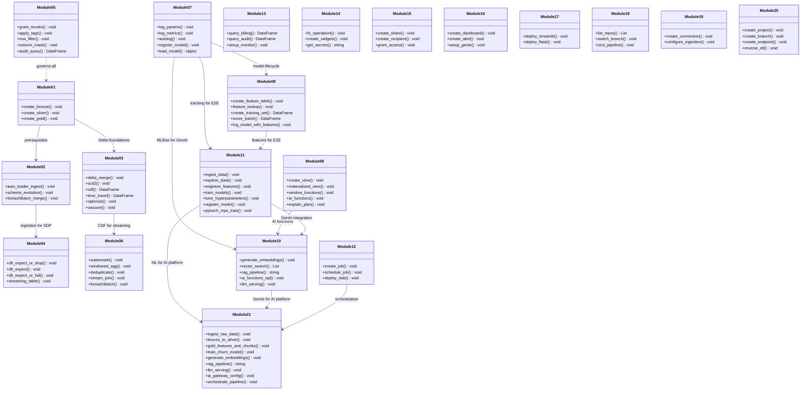
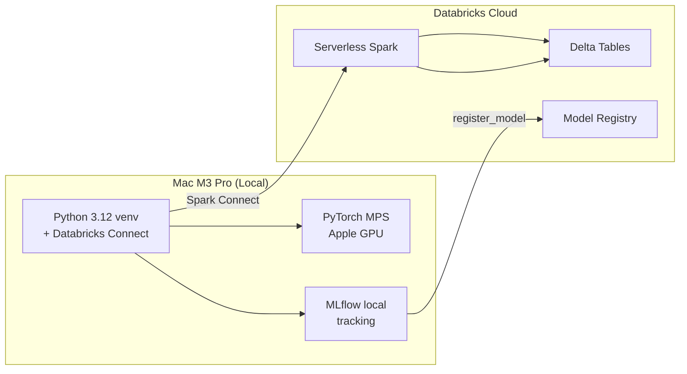

# Databricks Data Engineering — Comprehensive Use Cases

A hands-on learning resource for the Databricks platform covering Data Engineering, SQL, AI/ML, Governance, and GenAI. Each module is a self-contained notebook with runnable source code and conceptual documentation.

> **This repo is for learning only** — not a production template. The docs are conceptual references, not business scenarios.
>
> **Vendor-agnostic**: While the code runs on Databricks, the data engineering patterns (medallion architecture, ETL/ELT, CDC, SCD2, streaming, feature engineering, MLOps, data quality, governance) are applicable across any data platform (Snowflake, BigQuery, Synapse, Dremio). The Databricks implementation serves as a concrete reference — the concepts transfer.
>
> **Free Edition**: To follow along without a paid workspace, use [Databricks Free Edition](https://www.databricks.com/learn/free-edition).

## Use Cases Overview

| # | Module | Databricks Features | Level |
|---|--------|-------------------|-------|
| 01 | [01-medallion-fundamentals](01-medallion-fundamentals/simple_medallion_architecture) | Medallion Architecture, Delta Lake, Unity Catalog | Beginner |
| 02 | [02-auto-loader](02-auto-loader/auto_loader_streaming) | Auto Loader, cloudFiles, schema inference & evolution, checkpointing, foreachBatch + MERGE | Intermediate |
| 03 | [03-delta-advanced](03-delta-advanced/delta_advanced_features) | Delta MERGE, SCD Type 2, Change Data Feed, Time Travel, OPTIMIZE/ZORDER, VACUUM, Deletion Vectors, Apache Parquet, Apache Iceberg, Apache Avro, Apache ORC, JSON, CSV | Advanced |
| 04 | [04-sdp-pipelines](04-sdp-pipelines/sdp_medallion_pipeline) | Spark Declarative Pipelines (SDP), @dlt expectations, streaming tables, materialized views | Advanced |
| 05 | [05-uc-governance](05-uc-governance/uc_governance_demo) | Unity Catalog, GRANT/REVOKE, tags, row-level security, column masking, audit logs, lineage | Advanced |
| 06 | [06-structured-streaming](06-structured-streaming/structured_streaming_demo) | Structured Streaming, watermarks, windowed aggregations, deduplication, stream-stream joins, foreachBatch | Advanced |
| 07 | [07-mlflow-tracking](07-mlflow-tracking/mlflow_tracking_demo) | MLflow tracking, autologging, hyperparameter tuning, Model Registry, model serving | Intermediate |
| 08 | [08-databricks-sql](08-databricks-sql/databricks_sql_features) | Views, Materialized Views, Window Functions, CTEs, PIVOT, Delta SQL, AI Functions, Liquid Clustering | Intermediate |
| 09 | [09-feature-engineering](09-feature-engineering/feature_store_demo) | Feature Store, FeatureLookup, point-in-time joins, create_training_set, score_batch, model logging | Advanced |
| 10 | [10-genai-rag](10-genai-rag/genai_rag_demo) | AI Functions (SQL), Vector Search, embeddings, RAG pipeline, LLM serving, AI Gateway, Agent Bricks | Advanced |
| 11 | [11-end-to-end-ml-pipeline](11-end-to-end-ml-pipeline/end_to_end_ml_pipeline) | End-to-end: data → features → train → MLflow → registry → serving. Includes Mac M3 Pro local dev via Databricks Connect + PyTorch MPS | Advanced |
| 12 | [12-jobs-orchestration-dab](12-jobs-orchestration-dab/jobs_orchestration_dab) | Lakeflow Jobs, multi-task workflows, scheduling, triggers, Declarative Automation Bundles (DAB), CI/CD patterns | Advanced |
| 13 | [13-system-tables-monitoring](13-system-tables-monitoring/system_tables_monitoring) | system.billing, system.compute, system.access, system.query, system.lakeflow, data quality monitoring, SQL alerts | Advanced |
| 14 | [14-notebook-utilities-secrets](14-notebook-utilities-secrets/notebook_utilities_secrets) | dbutils.fs, dbutils.widgets, dbutils.secrets, %run, dbutils.notebook.run, library management, notebook context | Intermediate |
| 15 | [15-delta-sharing](15-delta-sharing/delta_sharing_demo) | Delta Sharing: shares, recipients, OPEN vs D2D, cross-org data access, provider/recipient patterns | Advanced |
| 16 | [16-dashboards-alerts-genie](16-dashboards-alerts-genie/dashboards_alerts_genie) | Lakeview dashboards, SQL alerts, Genie spaces (natural language Q&A), AI/BI | Intermediate |
| 17 | [17-databricks-apps](17-databricks-apps/databricks_apps_demo) | Databricks Apps: Streamlit, Flask, app.yaml, deployment, SDK management, serverless runtime | Advanced |
| 18 | [18-git-integration](18-git-integration/git_integration_demo) | Git folders, branch management, Git CLI, SDK API, CI/CD with DAB, GitHub Actions | Intermediate |
| 19 | [19-lakeflow-connect](19-lakeflow-connect/lakeflow_connect_demo) | Lakeflow Connect: managed ingestion from Salesforce, MySQL, PostgreSQL, Google Ads, HubSpot, ServiceNow | Advanced |
| 20 | [20-lakebase](20-lakebase/lakebase_demo) | Lakebase: managed PostgreSQL, projects, branches, autoscaling endpoints, Data API, reverse ETL to Delta Lake | Advanced |

## Documentation

Conceptual reference docs — not scenario walkthroughs. Read these before diving into the notebooks.

| Doc | Description |
|-----|-------------|
| [Medallion Architecture](docs/medallion-architecture.md) | Bronze/Silver/Gold pattern — layers, quality tiers, component & UML class diagrams, anti-patterns |
| [Data Engineering Concepts](docs/data-engineering-concepts.md) | ETL/ELT, idempotency, data quality, lineage, incremental processing, streaming patterns, orchestration |
| [Databricks Platform Overview](docs/databricks-platform-overview.md) | Compute, storage, governance, AI/ML components, UML class diagram, learning path flowchart |
| [Module Domain Guide](docs/module-domain-guide.md) | What each module teaches: domain concepts, why it matters, key terms, vendor-agnostic equivalents |
| [K8s + Databricks Integration](docs/k8s-databricks-integration.md) | Run pipelines from Kubernetes: 3 patterns (orchestrator, Connect, GitOps), prerequisites, security, troubleshooting |
| [SLM Training Guide](docs/slm-training-guide.md) | Small Language Model fine-tuning on Databricks GPU: LoRA/PEFT, DistilGPT2, MLflow, UC registration, inference |

## Coverage Matrix

### Databricks Platform Features

| Feature | Module | Status |
|---------|--------|--------|
| Medallion Architecture (Bronze/Silver/Gold) | 01 | ✅ Covered |
| Delta Lake (ACID, schema evolution, merge) | 01, 03 | ✅ Covered |
| Delta Lake Advanced (CDF, Time Travel, SCD2, VACUUM) | 03 | ✅ Covered |
| Auto Loader (file ingestion, schema inference) | 02 | ✅ Covered |
| Structured Streaming (watermarks, windows, joins) | 06 | ✅ Covered |
| Spark Declarative Pipelines (SDP / @dlt) | 04 | ✅ Covered |
| Unity Catalog (governance, tags, RLS, masks) | 05 | ✅ Covered |
| Databricks SQL (views, MV, window functions, CTEs) | 08 | ✅ Covered |
| AI Functions in SQL (ai_query, ai_forecast) | 08, 10 | ✅ Covered |
| Liquid Clustering & OPTIMIZE/ZORDER | 03, 08 | ✅ Covered |
| Deletion Vectors | 03 | ✅ Covered |
| MLflow (tracking, autologging, registry) | 07, 11 | ✅ Covered |
| Feature Store / Feature Engineering | 09, 11 | ✅ Covered |
| Model Serving (reference) | 07, 11 | ✅ Covered |
| Vector Search & RAG | 10 | ✅ Covered |
| LLM Serving & AI Gateway | 10 | ✅ Covered |
| Agent Bricks (reference) | 10 | ✅ Covered |
| End-to-End ML Pipeline | 11 | ✅ Covered |
| Databricks Connect (local dev, Mac M3 Pro) | 11 | ✅ Covered |
| PyTorch with Apple MPS (Mac M3 Pro) | 11 | ✅ Covered |
| Lakeflow Jobs (orchestration) | 12 | ✅ Covered |
| Declarative Automation Bundles (DAB) | 12 | ✅ Covered |
| Delta Sharing (cross-org data sharing) | 15 | ✅ Covered |
| Lakeflow Connect (managed ingestion) | 19 | ✅ Covered |
| Data Quality Monitoring / Lakehouse Monitoring | 13 | ✅ Covered |
| SQL Alerts | 13 | ✅ Covered |
| Genie Spaces | 16 | ✅ Covered |
| Lakeview Dashboards | 16 | ✅ Covered |
| Databricks Apps | 17 | ✅ Covered |
| System Tables (billing, audit, query history) | 13 | ✅ Covered |
| Notebook Utilities (dbutils, widgets, %run) | 14 | ✅ Covered |
| Secrets Management | 14 | ✅ Covered |
| Git Integration | 18 | ✅ Covered |
| Lakebase (Postgres autoscaling) | 20 | ✅ Covered |
| AI Platform (Raw Data → LLM Inference) | 21 | ✅ Covered |
| AI Gateway (rate limiting, fallback, logging) | 10, 21 | ✅ Covered |
| SLM Fine-Tuning (LoRA/PEFT, MLflow, UC Registry) | 22 | ✅ Covered |

### Data Engineering Topics

| Topic | Module(s) | Status |
|-------|-----------|--------|
| ETL / ELT patterns | 01, 02 | ✅ Covered |
| Idempotency (MERGE, overwrite) | 02, 03 | ✅ Covered |
| Data quality enforcement | 04, 03 | ✅ Covered |
| Incremental processing | 02, 03 | ✅ Covered |
| Change Data Capture (CDC) | 03 | ✅ Covered |
| Slowly Changing Dimensions (SCD Type 2) | 03 | ✅ Covered |
| Streaming deduplication | 06 | ✅ Covered |
| Stream-stream / stream-static joins | 06 | ✅ Covered |
| Schema management & evolution | 02, 03 | ✅ Covered |
| Data governance & security | 05 | ✅ Covered |
| Feature engineering | 09, 11 | ✅ Covered |
| Model training & evaluation | 07, 11 | ✅ Covered |
| Hyperparameter tuning | 07, 11 | ✅ Covered |
| Model registry & lifecycle | 07, 11 | ✅ Covered |
| Local development (Databricks Connect) | 11 | ✅ Covered |
| Workflow orchestration | 12 | ✅ Covered |
| CI/CD with DAB | 12, 18 | ✅ Covered |
| Data pipeline monitoring | 13 | ✅ Covered |
| AI Platform integration (data → ML → GenAI) | 21 | ✅ Covered |
| SLM / LLM fine-tuning (LoRA, PEFT, HuggingFace) | 22 | ✅ Covered |
| Apache Parquet (columnar format, compression) | 03 | ✅ Covered |
| Apache Iceberg (open table format, snapshots) | 03 | ✅ Covered |
| Apache Avro (row-based, Kafka native) | 03 | ✅ Covered |
| Apache ORC (columnar, Hive/Presto native) | 03 | ✅ Covered |
| JSON (semi-structured, schema on read) | 03 | ✅ Covered |
| CSV (text-based, universal data exchange) | 03 | ✅ Covered |

## Databricks Platform Domains

The Databricks Data + AI Platform is organised into 12 domains. Each domain solves a specific problem in the data and AI lifecycle. Every module in this repo maps to one or more domains.

### 1. Compute — The Execution Engine

**What it is**: The compute layer runs your code — Spark jobs, SQL queries, ML training, model serving, and notebooks. Databricks abstracts away infrastructure management so you focus on code, not servers.

| Compute Type | Description | Best For |
|-------------|-------------|----------|
| **Serverless** | Auto-provisioned, auto-scaled, pay-per-use. No cluster to manage | Notebooks, jobs, pipelines, streaming |
| **Serverless GPU** | GPU-accelerated serverless with AI base environment (torch, transformers pre-installed) | SLM/LLM training, GPU inference |
| **Classic Clusters** | User-managed Spark clusters with custom configs | Legacy workloads, custom JARs, init scripts |
| **SQL Warehouses** | Optimised for SQL queries, auto-start/stop | BI tools, dashboards, ad-hoc SQL |

**Modules**: All (compute is foundational)

### 2. Data Ingestion — Getting Data Into the Platform

**What it is**: Ingestion moves data from external sources (cloud storage, databases, SaaS apps, message buses) into Delta tables on Databricks. The platform offers both batch and streaming ingestion.

| Tool | Description | When to Use |
|------|-------------|-------------|
| **Auto Loader** | Incremental file ingestion from cloud storage with schema inference and evolution | Files landing in S3/ADLS/GCS — most common |
| **Lakeflow Connect** | Fully-managed connectors for Salesforce, MySQL, PostgreSQL, Google Ads, etc. | Enterprise apps and databases — no code needed |
| **COPY INTO** | Idempotent batch loads from cloud storage | One-time loads or simple batch |
| **Structured Streaming** | Real-time stream processing from Kafka, Kinesis, Event Hubs | Low-latency, continuous ingestion |

**Modules**: 02 (Auto Loader), 06 (Streaming), 19 (Lakeflow Connect)

### 3. Data Storage — Delta Lake

**What it is**: Delta Lake is the storage layer that brings ACID transactions, schema enforcement, and time travel to your data lake. All tables in Databricks are Delta tables by default.

| Feature | Description |
|---------|-------------|
| **ACID transactions** | Serializable isolation — safe concurrent reads and writes |
| **Time Travel** | Query data at any historical version or timestamp — rollback, audit |
| **Change Data Feed (CDF)** | Row-level change tracking (inserts, updates, deletes) for CDC pipelines |
| **Schema evolution** | Add columns automatically with `MERGE_SCHEMA` or `addNewColumns` |
| **Deletion Vectors** | Lazy deletion — faster UPDATE/DELETE without full file rewrites |
| **Liquid Clustering** | Self-optimising data layout — replaces partitioning + ZORDER |
| **OPTIMIZE / ZORDER** | File compaction and data co-location by key |
| **VACUUM** | Remove orphaned files past retention threshold |

**Modules**: 01 (Medallion), 03 (Delta Advanced)

### 4. Data Governance — Unity Catalog

**What it is**: Unity Catalog is the central governance layer — it manages who can access what data, tracks lineage, classifies data with tags, and audits all access. It uses a three-level namespace: `catalog.schema.table`.

| Feature | Description |
|---------|-------------|
| **Three-level namespace** | `catalog.schema.table` — organises data like a file system |
| **GRANT / REVOKE** | Fine-grained privileges (SELECT, MODIFY, CREATE, etc.) |
| **Row-Level Security (RLS)** | Filter rows per user/group — e.g., only see your region's data |
| **Column Masking** | Mask sensitive columns (PII, financial) per user role |
| **Tags** | Classify data (PII, sensitive, public) for governance policies |
| **Lineage** | Visual graph of data flow from source to dashboard |
| **Audit Logs** | Every access logged — who accessed what, when, how |

**Modules**: 05 (UC Governance)

### 5. Data Engineering — Transforming and Processing Data

**What it is**: The data engineering domain transforms raw data into analytics-ready tables using batch processing, streaming, and declarative pipelines. This is the core of the medallion architecture (Bronze → Silver → Gold).

| Tool | Description |
|------|-------------|
| **Apache Spark** | Distributed compute engine — batch and streaming DataFrames |
| **Spark Declarative Pipelines (SDP)** | Declarative pipelines in SQL/Python with data quality expectations, streaming tables, and materialised views |
| **Structured Streaming** | Real-time stream processing with watermarks, windowed aggregations, stream-stream joins |
| **Delta Lake operations** | MERGE (upsert), CDF, Time Travel, OPTIMIZE, VACUUM |

**Modules**: 01 (Medallion), 02 (Auto Loader), 03 (Delta Advanced), 04 (SDP), 06 (Streaming)

### 6. SQL Analytics — Querying and Visualising Data

**What it is**: The SQL analytics domain lets analysts and business users query data with SQL, build dashboards, set up alerts, and ask natural-language questions — all without writing code.

| Tool | Description |
|------|-------------|
| **Databricks SQL** | SQL editor with views, materialised views, window functions, CTEs, PIVOT, AI functions |
| **Lakeview Dashboards** | Interactive BI dashboards with filters, cross-filtering, drill-down |
| **SQL Alerts** | Monitor query results and get notified when conditions are met |
| **Genie Agents** | Natural-language Q&A over your data — no SQL needed |

**Modules**: 08 (Databricks SQL), 16 (Dashboards, Alerts, Genie)

### 7. AI / ML — Machine Learning Lifecycle

**What it is**: The AI/ML domain covers the full machine learning lifecycle — from feature engineering to model training, tracking, evaluation, registry, and serving.

| Service | Description |
|---------|-------------|
| **MLflow** | Experiment tracking, model registry, model serving — open source |
| **Feature Store** | Centralised feature management with point-in-time correctness |
| **Model Training** | Distributed training on CPU or GPU compute (PyTorch, scikit-learn, XGBoost) |
| **SLM Fine-Tuning** | Domain-specific small language model training with LoRA/PEFT on GPU serverless |
| **Model Serving** | Real-time inference via REST API endpoints with autoscaling |

**Modules**: 07 (MLflow), 09 (Feature Store), 11 (End-to-End ML), 22 (SLM Training)

### 8. GenAI — Generative AI Applications

**What it is**: The GenAI domain builds AI applications on top of large language models — RAG pipelines, vector search, LLM serving, and agent development with governance.

| Service | Description |
|---------|-------------|
| **AI Search (Vector Search)** | Index embeddings for semantic similarity search — powers RAG |
| **RAG Pipelines** | Retrieval-augmented generation — ground LLM responses in your data |
| **LLM Serving** | Serve foundation models (Llama, Mixtral, GPT) via REST API |
| **AI Gateway** | Rate limiting, fallback, token logging, guardrails for LLM endpoints |
| **Agent Development** | Build custom agents with tools, MCP servers, and Genie Agents |
| **AI Functions (SQL)** | `ai_query`, `ai_forecast`, `ai_analyze_sentiment` — call LLMs from SQL |

**Modules**: 10 (GenAI RAG), 21 (AI Platform)

### 9. Orchestration — Scheduling and Automating Workflows

**What it is**: The orchestration domain schedules and automates multi-step workflows — ETL pipelines, ML training jobs, data refresh, and CI/CD pipelines.

| Tool | Description |
|------|-------------|
| **Lakeflow Jobs** | Multi-task workflows with scheduling, triggers (file arrival, table update), and dependencies |
| **Declarative Automation Bundles (DAB)** | Infrastructure-as-code for CI/CD — define jobs, pipelines, and resources in YAML |

**Modules**: 12 (Jobs & DAB), 18 (Git Integration)

### 10. Data Sharing — Cross-Organisation Collaboration

**What it is**: The data sharing domain lets you securely share data with external organisations without copying or moving data — using the open Delta Sharing protocol.

| Feature | Description |
|---------|-------------|
| **Shares** | A collection of tables, notebooks, or files you share with recipients |
| **Recipients** | Open (token-based) or Databricks-to-Databricks authentication |
| **Providers** | Consume data shared by other organisations as a Unity Catalog catalog |

**Modules**: 15 (Delta Sharing)

### 11. App Development — Building Data Applications

**What it is**: The app development domain lets you build and deploy data and AI applications (Streamlit, Flask, Gradio, Dash) directly on the Databricks platform — no separate infrastructure needed.

| Feature | Description |
|---------|-------------|
| **Databricks Apps** | Serverless app hosting with OAuth authentication, UC integration |
| **Supported frameworks** | Streamlit, Flask, Gradio, Dash, React, Express |

**Modules**: 17 (Databricks Apps)

### 12. Monitoring & Observability — Platform Health

**What it is**: The monitoring domain tracks platform health, costs, query performance, audit trails, and data quality through system tables and dashboards.

| System Table | Description |
|--------------|-------------|
| **system.billing** | DBU consumption, costs by workspace, compute type, job |
| **system.compute** | Cluster/warehouse events, runtime, auto-termination |
| **system.access** | Audit log — who accessed what, when, from where |
| **system.query** | Query history, duration, rows, errors |
| **system.lakeflow** | Job and pipeline runs, status, duration |

**Modules**: 13 (System Tables & Monitoring)

### Domain-to-Module Matrix

| Domain | Modules |
|--------|---------|
| Compute | All (foundational) |
| Data Ingestion | 02, 06, 19 |
| Data Storage (Delta Lake) | 01, 03 |
| Data Governance (UC) | 05 |
| Data Engineering | 01, 02, 03, 04, 06 |
| SQL Analytics | 08, 16 |
| AI / ML | 07, 09, 11, 22 |
| GenAI | 10, 21 |
| Orchestration | 12, 18 |
| Data Sharing | 15 |
| App Development | 17 |
| Monitoring & Observability | 13 |

## Architecture — Component Diagram

```mermaid
graph TB
    subgraph DataEng [Data Engineering]
        AL[Auto Loader<br/>02]
        DL[Delta Lake Advanced<br/>03]
        SDP[SDP Pipelines<br/>04]
        SS[Structured Streaming<br/>06]
        JOB[Jobs and DAB<br/>12]
        LC[Lakeflow Connect<br/>19]
    end

    subgraph DataPlatform [Data Platform]
        UC[Unity Catalog<br/>05]
        SQL[Databricks SQL<br/>08]
        MF[Medallion Fundamentals<br/>01]
        ST[System Tables<br/>13]
        UT[Utilities and Secrets<br/>14]
        DS[Delta Sharing<br/>15]
    end

    subgraph AI [AI / ML]
        MLF[MLflow Tracking<br/>07]
        FE[Feature Engineering<br/>09]
        RAG[GenAI / RAG<br/>10]
        E2E[End-to-End ML<br/>11]
        AIP[AI Platform<br/>21]
    end

    subgraph BI [BI and Apps]
        DASH[Dashboards and Genie<br/>16]
        APPS[Databricks Apps<br/>17]
        GIT[Git Integration<br/>18]
        LB[Lakebase<br/>20]
    end

    subgraph Storage [Unity Catalog — demo]
        S_Bronze[bronze schema]
        S_Silver[silver schema]
        S_Gold[gold schema]
        S_Delta[delta schema]
        S_Gov[governance schema]
        S_Stream[streaming schema]
        S_SDP[sdp schema]
        S_FE[features schema]
        S_GenAI[genai schema]
        S_SQL[sql_demo schema]
        S_ML2[ml_pipeline schema]
        S_Utils[utils schema]
        S_LB[lakebase schema]
        S_AIP[ai_platform schema]
    end

    subgraph Compute [Compute]
        SVR[Serverless Compute<br/>auto-scaled]
        WH[SQL Warehouse<br/>for DBSQL]
    end

    MF --> S_Bronze & S_Silver & S_Gold
    AL --> S_Bronze
    DL --> S_Delta
    SDP --> S_SDP
    UC --> S_Gov
    SS --> S_Stream
    SQL --> S_SQL
    FE --> S_FE
    RAG --> S_GenAI
    E2E --> S_ML2
    AIP --> S_AIP
    UT --> S_Utils
    LB --> S_LB
    MLF --> Compute

    DataEng --> Compute
    DataPlatform --> Compute
    AI --> Compute
    BI --> Compute
    Storage --> Compute
```



## Module Dependencies — UML Class Diagram



## Project Structure

```mermaid
flowchart TD
    ROOT[dataengineering/] --> README[README.md<br/>Entry point]
    ROOT --> MAKE[Makefile<br/>Setup automation]
    ROOT --> SCRIPTS[scripts/<br/>Test scripts]
    ROOT --> DOCS[docs/<br/>Documentation]
    ROOT --> M01[01-medallion-fundamentals/]
    ROOT --> M02[02-auto-loader/]
    ROOT --> M03[03-delta-advanced/]
    ROOT --> M04[04-sdp-pipelines/]
    ROOT --> M05[05-uc-governance/]
    ROOT --> M06[06-structured-streaming/]
    ROOT --> M07[07-mlflow-tracking/]
    ROOT --> M08[08-databricks-sql/]
    ROOT --> M09[09-feature-engineering/]
    ROOT --> M10[10-genai-rag/]
    ROOT --> M11[11-end-to-end-ml-pipeline/]
    ROOT --> M12[12-jobs-orchestration-dab/]
    ROOT --> M13[13-system-tables-monitoring/]
    ROOT --> M14[14-notebook-utilities-secrets/]
    ROOT --> M15[15-delta-sharing/]
    ROOT --> M16[16-dashboards-alerts-genie/]
    ROOT --> M17[17-databricks-apps/]
    ROOT --> M18[18-git-integration/]
    ROOT --> M19[19-lakeflow-connect/]
    ROOT --> M20[20-lakebase/]
    ROOT --> M21[21-ai-platform/]
    ROOT --> M22[22-slm-training/]
    ROOT --> K8S[k8s/]

    DOCS --> D1[medallion-architecture.md]
    DOCS --> D2[data-engineering-concepts.md]
    DOCS --> D3[databricks-platform-overview.md]
    DOCS --> D4[module-domain-guide.md]
    DOCS --> D5[k8s-databricks-integration.md]
    DOCS --> D6[slm-training-guide.md]
```



```
dataengineering/
├── README.md                                    # Entry point + documentation index
├── Makefile.py                                  # Mac M3 Pro setup automation (rename to Makefile locally)
├── scripts/                                      # Local dev scripts
│   └── test_databricks_connect.py              # Mac M3 Pro pipeline test script
├── docs/                                        # Conceptual documentation
│   ├── medallion-architecture.md                # Medallion Architecture guide
│   ├── data-engineering-concepts.md             # Core data engineering principles
│   ├── databricks-platform-overview.md           # Platform components overview
│   ├── module-domain-guide.md                    # What each module domain teaches
│   ├── k8s-databricks-integration.md            # K8s + Databricks integration guide
│   └── slm-training-guide.md                   # SLM fine-tuning guide (LoRA/PEFT)
├── k8s/                                          # K8s deployment (Pattern 1)
│   ├── trigger_pipeline.py                     # Python trigger script (SDK + OAuth M2M)
│   ├── Dockerfile                              # Lightweight trigger image
│   ├── k8s-secret.yaml                         # K8s Secret for OAuth credentials
│   ├── k8s-configmap.yaml                      # K8s ConfigMap for pipeline config
│   ├── k8s-cronjob.yaml                        # K8s CronJob manifest
│   └── README.md                               # K8s setup guide + troubleshooting
├── 01-medallion-fundamentals/
│   └── simple_medallion_architecture.ipynb       # 01 — Bronze/Silver/Gold basics
├── 02-auto-loader/
│   └── auto_loader_streaming.ipynb               # 02 — Auto Loader ingestion
├── 03-delta-advanced/
│   └── delta_advanced_features.ipynb             # 03 — Delta Lake advanced
├── 04-sdp-pipelines/
│   └── sdp_medallion_pipeline.ipynb              # 04 — Spark Declarative Pipelines
├── 05-uc-governance/
│   └── uc_governance_demo.ipynb                  # 05 — Unity Catalog governance
├── 06-structured-streaming/
│   └── structured_streaming_demo.ipynb           # 06 — Structured Streaming
├── 07-mlflow-tracking/
│   └── mlflow_tracking_demo.ipynb               # 07 — MLflow model tracking
├── 08-databricks-sql/
│   └── databricks_sql_features.ipynb             # 08 — Databricks SQL
├── 09-feature-engineering/
│   └── feature_store_demo.ipynb                  # 09 — Feature Store & training sets
├── 10-genai-rag/
│   └── genai_rag_demo.ipynb                      # 10 — GenAI, Vector Search & RAG
└── 11-end-to-end-ml-pipeline/
    └── end_to_end_ml_pipeline.ipynb             # 11 — End-to-end ML + Mac M3 Pro
├── 12-jobs-orchestration-dab/
│   └── jobs_orchestration_dab.ipynb            # 12 — Jobs, DAB, CI/CD
├── 13-system-tables-monitoring/
│   └── system_tables_monitoring.ipynb         # 13 — System tables & monitoring
├── 14-notebook-utilities-secrets/
│   └── notebook_utilities_secrets.ipynb      # 14 — dbutils, widgets, secrets
├── 15-delta-sharing/
│   └── delta_sharing_demo.ipynb              # 15 — Delta Sharing
├── 16-dashboards-alerts-genie/
│   └── dashboards_alerts_genie.ipynb          # 16 — Dashboards, alerts, Genie
├── 17-databricks-apps/
│   └── databricks_apps_demo.ipynb            # 17 — Databricks Apps
├── 18-git-integration/
│   └── git_integration_demo.ipynb            # 18 — Git folders & CI/CD
├── 19-lakeflow-connect/
│   └── lakeflow_connect_demo.ipynb           # 19 — Managed ingestion connectors
└── 20-lakebase/
    └── lakebase_demo.ipynb                  # 20 — Lakebase Postgres
├── 21-ai-platform/
    └── ai_platform_demo.ipynb              # 21 — AI Platform: raw data → LLM inference
├── 22-slm-training/
│   └── slm_kubernetes_finetune.ipynb        # 22 — SLM fine-tuning (DistilGPT2 + LoRA)
└── k8s/                                      # K8s + Databricks integration (Pattern 1)
    ├── trigger_pipeline.py                  # SDK trigger script
    ├── Dockerfile                           # Trigger pod image
    ├── k8s-secret.yaml                      # OAuth credentials
    ├── k8s-configmap.yaml                   # Pipeline config
    ├── k8s-cronjob.yaml                     # CronJob manifest
    └── README.md                            # Setup guide
```

## Unity Catalog Structure

```
demo (catalog)
├── bronze (schema)      # 01, 02 — raw ingestion layer
├── silver (schema)      # 01, 02 — cleaned data
├── gold (schema)        # 01 — aggregated metrics
├── delta (schema)       # 03 — Delta MERGE/CDF/time travel
├── governance (schema)  # 05 — RLS/column masking
├── streaming (schema)   # 06 — streaming sinks
├── sdp (schema)         # 04 — SDP pipeline target
├── sql_demo (schema)    # 08 — SQL views/MV/window functions
├── features (schema)    # 09 — feature tables
├── genai (schema)       # 10 — embeddings/RAG/Vector Search
├── ml (schema)         # 09 — training events & models
└── ml_pipeline (schema)  # 11 — end-to-end ML pipeline
├── utils (schema)       # 14 — notebook utilities
└── lakebase (schema)    # 20 — Lakebase synced tables
└── ai_platform (schema) # 21 — AI platform: bronze/silver/gold, embeddings, RAG
└── slm (schema)         # 22 — SLM training data, model artifacts
```

## Prerequisites

- Databricks workspace with **Unity Catalog** enabled
- Permissions to create catalogs, schemas, and volumes
- **Serverless compute** (auto-selected) or a Databricks cluster
- For **04 — SDP**: Spark Declarative Pipelines enabled in the workspace
- For **11 — Local dev on Mac M3 Pro**: Python 3.12+, `pip install databricks-connect databricks-sdk mlflow scikit-learn torch`
- For **K8s integration**: K8s cluster, `kubectl`, container registry, Databricks service principal (OAuth M2M). See [k8s/README.md](k8s/README.md) for setup
- **No paid workspace?** Use [Databricks Free Edition](https://www.databricks.com/learn/free-edition) — free, no credit card required

## Kubernetes Integration

Run the AI Platform pipeline (module 21) from Kubernetes. K8s triggers and monitors the pipeline; all Spark/ML/RAG compute runs on Databricks serverless.

| Pattern | Description | K8s Role | Implemented |
|---------|-------------|---------|:-----------:|
| **1. K8s Orchestrator** | K8s CronJob triggers Lakeflow Job via SDK | Trigger + monitor | ✅ `k8s/` |
| **2. Databricks Connect** | K8s pod runs PySpark on Databricks serverless | Execute Spark code | Reference |
| **3. DAB + GitOps** | ArgoCD/Flux deploys DAB bundles to Databricks | CI/CD deployment | Reference |

See [docs/k8s-databricks-integration.md](docs/k8s-databricks-integration.md) for all 3 patterns, prerequisites, and security checklist.

```bash
# Quick start — Pattern 1 (K8s orchestrator)
cd k8s && docker build -t your-registry/ai-platform-trigger:latest .
kubectl create secret generic databricks-auth \
  --from-literal=DATABRICKS_HOST='https://<workspace>.cloud.databricks.com' \
  --from-literal=DATABRICKS_CLIENT_ID='<sp-uuid>' \
  --from-literal=DATABRICKS_CLIENT_SECRET='<oauth-secret>' -n databricks-pipeline
kubectl apply -f k8s-configmap.yaml && kubectl apply -f k8s-cronjob.yaml
```

## Running the Notebooks

### 01 — Simple Medallion (Beginner)
1. Open `01-medallion-fundamentals/simple_medallion_architecture.ipynb`
2. Run all cells in sequence
3. Creates `ops` catalog with bronze, silver, and gold schemas

### 02 — Auto Loader (Intermediate)
1. Open `02-auto-loader/auto_loader_streaming.ipynb`
2. Run all cells in sequence
3. Creates `demo` catalog with a volume for file simulation
4. Demonstrates schema inference, evolution, `availableNow` trigger, and `foreachBatch` + MERGE

### 03 — Delta Lake Advanced (Advanced)
1. Open `03-delta-advanced/delta_advanced_features.ipynb`
2. Run all cells in sequence
3. Demonstrates MERGE upserts, SCD Type 2, CDF, Time Travel, OPTIMIZE/ZORDER, VACUUM, deletion vectors, Apache Parquet (compression, predicate pushdown, column pruning), Apache Iceberg (Delta UniForm, snapshots, time travel), Apache Avro (row-based, Kafka native), Apache ORC (columnar, Hive/Presto), JSON (schema on read, type loss), CSV (explicit schema, inferSchema), and full 7-format file size comparison

### 04 — SDP Pipelines (Advanced)
1. Open `04-sdp-pipelines/sdp_medallion_pipeline.ipynb`
2. Create a Spark Declarative Pipeline in the Databricks UI
3. Attach this notebook as the pipeline source
4. Set target schema to `demo.sdp`
5. Run the pipeline update

### 05 — UC Governance (Advanced)
1. Open `05-uc-governance/uc_governance_demo.ipynb`
2. Run all cells in sequence
3. Demonstrates GRANT/REVOKE, tags, row-level security, column masking, and audit log queries

### 06 — Structured Streaming (Advanced)
1. Open `06-structured-streaming/structured_streaming_demo.ipynb`
2. Run all cells in sequence
3. Demonstrates watermarks, windowed aggregations, deduplication, `foreachBatch` + MERGE, stream-static joins, and stream-stream joins

### 07 — MLflow Tracking (Intermediate)
1. Open `07-mlflow-tracking/mlflow_tracking_demo.ipynb`
2. Run all cells in sequence
3. Demonstrates manual logging, autologging, hyperparameter grid search, Model Registry, and model loading

### 08 — Databricks SQL (Intermediate)
1. Open `08-databricks-sql/databricks_sql_features.ipynb`
2. Run all cells in sequence
3. Demonstrates views, materialized views, window functions, CTEs, PIVOT, Delta SQL, AI functions, and query optimization

### 09 — Feature Engineering (Advanced)
1. Open `09-feature-engineering/feature_store_demo.ipynb`
2. Run all cells in sequence
3. Demonstrates feature tables, FeatureLookup, point-in-time joins, training sets, model logging with feature spec, and batch scoring

### 10 — GenAI / RAG (Advanced)
1. Open `10-genai-rag/genai_rag_demo.ipynb`
2. Run all cells in sequence
3. Demonstrates AI functions (SQL), embeddings, Vector Search, RAG pipeline, LLM serving, and AI Gateway

### 11 — End-to-End ML Pipeline (Advanced)
1. Open `11-end-to-end-ml-pipeline/end_to_end_ml_pipeline.ipynb`
2. Run all cells in sequence
3. Full pipeline: data ingestion → exploration → feature engineering → model training → MLflow tracking → hyperparameter tuning → evaluation → model registry
4. Includes PyTorch training with Apple MPS on Mac M3 Pro and Databricks Connect local dev setup

### 12 — Jobs, Orchestration & DAB (Advanced)
1. Open `12-jobs-orchestration-dab/jobs_orchestration_dab.ipynb`
2. Run all cells in sequence
3. Creates a multi-task job via SDK, demonstrates trigger types, DAB structure, and CI/CD patterns

### 13 — System Tables & Monitoring (Advanced)
1. Open `13-system-tables-monitoring/system_tables_monitoring.ipynb`
2. Run all cells in sequence
3. Queries system.billing, system.compute, system.access, system.query, system.lakeflow tables
4. Demonstrates data quality monitoring setup and SQL alerts

### 14 — Notebook Utilities & Secrets (Intermediate)
1. Open `14-notebook-utilities-secrets/notebook_utilities_secrets.ipynb`
2. Run all cells in sequence
3. Demonstrates dbutils.fs, dbutils.widgets, dbutils.secrets, %run, and library management

### 15 — Delta Sharing (Advanced)
1. Open `15-delta-sharing/delta_sharing_demo.ipynb`
2. Run all cells in sequence
3. Creates shares, recipients, and demonstrates provider/recipient access patterns

### 16 — Dashboards, Alerts & Genie (Intermediate)
1. Open `16-dashboards-alerts-genie/dashboards_alerts_genie.ipynb`
2. Run all cells in sequence
3. Covers Lakeview dashboard creation, SQL alerts, and Genie space concepts

### 17 — Databricks Apps (Advanced)
1. Open `17-databricks-apps/databricks_apps_demo.ipynb`
2. Run all cells in sequence
3. Shows Streamlit and Flask app structure, app.yaml config, and deployment commands

### 18 — Git Integration (Intermediate)
1. Open `18-git-integration/git_integration_demo.ipynb`
2. Run all cells in sequence
3. Lists Git folders, demonstrates branch management and CI/CD pipeline patterns

### 19 — Lakeflow Connect (Advanced)
1. Open `19-lakeflow-connect/lakeflow_connect_demo.ipynb`
2. Run all cells in sequence
3. Shows managed ingestion connector setup for Salesforce, MySQL, PostgreSQL, and more

### 20 — Lakebase (Advanced)
1. Open `20-lakebase/lakebase_demo.ipynb`
2. Run all cells in sequence
3. Covers Lakebase project/branch/endpoint creation, Data API, and reverse ETL to Delta Lake

### 21 — AI Platform (Advanced)
1. Open `21-ai-platform/ai_platform_demo.ipynb`
2. Run all cells in sequence
3. End-to-end AI platform: raw data to medallion, ML training, embeddings, Vector Search, RAG, LLM serving, AI Gateway

### 22 — SLM Training (Advanced)
1. Open `22-slm-training/slm_kubernetes_finetune.ipynb`
2. **Requires Serverless GPU compute** (AI v5 base environment)
3. Run all cells in sequence: data prep, tokenization, LoRA fine-tuning, MLflow logging, UC registration, inference
4. Fine-tunes DistilGPT2 (82M params) on Kubernetes Q&A data using LoRA/PEFT

## Documentation

Start with the conceptual documentation before diving into the notebooks:

1. [Medallion Architecture](docs/medallion-architecture.md) — Understand the Bronze/Silver/Gold pattern
2. [Data Engineering Concepts](docs/data-engineering-concepts.md) — What is data engineering, its role in ML and GenAI, plus core principles
3. [Databricks Platform Overview](docs/databricks-platform-overview.md) — Platform components, compute, storage, and learning path
4. [Module Domain Guide](docs/module-domain-guide.md) — What each module's domain is (orchestration, governance, RAG, etc.) with vendor-agnostic equivalents

## Mac M3 Pro — Local Development

Module 11 includes full instructions for running the ML pipeline locally on Mac M3 Pro using **Databricks Connect** (Spark Connect protocol):



### Quick Setup with Makefile

The fastest way to set up everything — the Makefile automates venv creation, package installation, authentication, and testing:

```bash
# 1. One-command setup: create venv + install all packages
make setup

# 2. Interactive: set workspace URL and token in ~/.databrickscfg
make configure

# 3. Run the full 6-step pipeline test
make test

# Or run individual tests
make test-spark    # Spark connection only
make test-pytorch  # PyTorch MPS (Apple Silicon GPU)
make test-mlflow   # MLflow tracking
make test-sdk      # Databricks SDK (workspace API)
make info          # Show current environment info
make clean         # Remove venv and test artifacts
```

> **Note**: The Makefile is saved as `Makefile.py` in the Databricks workspace. Rename to `Makefile` (no extension) locally: `cp Makefile.py Makefile`

### Step 1: Create virtual environment

```bash
python3.12 -m venv ~/databricks-env
source ~/databricks-env/bin/activate
```

### Step 2: Install packages

```bash
pip install databricks-connect databricks-sdk mlflow scikit-learn pandas torch
```

### Step 3: Configure authentication

Generate a Personal Access Token from your workspace:
**Settings → Developer → Access tokens → Generate new token**

Then create `~/.databrickscfg` (replace with your values):

```bash
cat > ~/.databrickscfg << 'EOF'
[DEFAULT]
host  = https://<your-workspace>.cloud.databricks.com
token = <your-personal-access-token>
EOF
```

### Step 4: Set serverless environment variable

```bash
export DATABRICKS_CONNECT_SERVERLESS=1
```

Add to `~/.zshrc` for persistence:
```bash
echo 'export DATABRICKS_CONNECT_SERVERLESS=1' >> ~/.zshrc
```

### Step 5: Test the connection

```bash
python3.12 -c "
from databricks.connect import DatabricksSession
spark = DatabricksSession.builder.serverless(True).getOrCreate()
print(spark.sql('SELECT 1').collect())
"
```

Expected output: `[Row(1=1)]`

### Step 6: Run the full pipeline test

This repo includes a test script that verifies the entire data pipeline from your Mac to Databricks:

```bash
source ~/databricks-env/bin/activate
export DATABRICKS_CONNECT_SERVERLESS=1
python3.12 scripts/test_databricks_connect.py
```

The script tests:
1. Environment check (packages, config, env vars)
2. Spark connection to serverless compute
3. Mini Bronze → Silver → Gold pipeline (create tables, write, transform, aggregate)
4. PyTorch MPS (Apple Silicon GPU acceleration)
5. MLflow experiment tracking
6. Databricks SDK (workspace API access)

### Troubleshooting

| Issue | Fix |
|------|-----|
| `No module named 'databricks'` | Use venv Python: `~/databricks-env/bin/python3` |
| `cannot configure default credentials` | Ensure `~/.databrickscfg` has `host` and `token` |
| `Cluster id or serverless are required` | Run: `export DATABRICKS_CONNECT_SERVERLESS=1` |
| `DATABRICKS_HOST` env conflicts | Run: `unset DATABRICKS_HOST` (let SDK read `.databrickscfg`) |
| Old CLI `auth` command not found | Install new CLI: `curl -fsSL https://raw.githubusercontent.com/databricks/cli/main/scripts/install \| bash` |

See [Module 11](11-end-to-end-ml-pipeline/end_to_end_ml_pipeline) for the complete guide including PyTorch with Apple MPS (Metal Performance Shaders).

## Key Features Across Modules

- **Delta Lake**: ACID transactions, schema evolution, time travel, CDF, deletion vectors, liquid clustering
- **Unity Catalog**: Three-level namespace, governance, tags, row-level security, column masking, audit trail
- **Streaming**: Auto Loader, Structured Streaming, and SDP streaming tables with watermarks and joins
- **Data Quality**: SDP expectations (`expect`, `expect_or_drop`, `expect_or_fail`) and Delta constraints
- **SQL Analytics**: Views, materialized views, window functions, CTEs, PIVOT, AI functions in SQL
- **ML Lifecycle**: MLflow tracking, autologging, hyperparameter tuning, Model Registry, Feature Store
- **GenAI**: Vector Search, AI functions (SQL), RAG pipelines, LLM serving, AI Gateway, Agent Bricks
- **End-to-End ML**: Data to features to train to evaluate to register to serve (with PyTorch MPS on Mac M3 Pro)
- **Orchestration**: Lakeflow Jobs (multi-task, scheduling, triggers) and DAB (infrastructure-as-code, CI/CD)
- **System Tables and Monitoring**: billing, compute, audit, query history, job runs, data quality monitoring
- **Notebook Utilities**: dbutils (fs, widgets, secrets), %run, library management, notebook context
- **Delta Sharing**: Open protocol cross-org data sharing (shares, recipients, providers)
- **BI and Genie**: Lakeview dashboards, SQL alerts, Genie natural-language Q&A spaces
- **Databricks Apps**: Serverless data apps (Streamlit, Flask, Dash, Gradio)
- **Git Integration**: Git folders, branch management, CI/CD pipelines with DAB
- **Lakeflow Connect**: Managed ingestion from external sources (Salesforce, MySQL, Google Ads, etc.)
- **Lakebase**: Managed PostgreSQL with autoscaling, branching, and reverse ETL
- **AI Platform**: Raw data to LLM inference — medallion processing, ML training, embeddings, Vector Search, RAG, LLM serving, AI Gateway, orchestration
- **SLM Training**: Domain-specific Small Language Model fine-tuning on GPU serverless (DistilGPT2 + LoRA/PEFT, HuggingFace Trainer, MLflow, UC model registry, inference)
- **K8s Integration**: Run pipelines from Kubernetes (CronJob + SDK trigger, Databricks Connect, GitOps with DAB). OAuth M2M auth, security hardening
- **Local Development**: Databricks Connect on Mac M3 Pro with Apple Silicon GPU acceleration, Makefile for automated setup, and test script for full pipeline verification

## References

- [Databricks Documentation](https://docs.databricks.com/aws/en/index/)
- [Medallion Architecture](https://www.databricks.com/glossary/medallion-architecture)
- [Delta Lake](https://docs.delta.io/)
- [Unity Catalog](https://docs.databricks.com/aws/en/data-governance/unity-catalog/index/)
- [Auto Loader](https://docs.databricks.com/aws/en/ingestion/cloud-object-storage/auto-loader/index/)
- [Spark Declarative Pipelines](https://docs.databricks.com/aws/en/ldp/index/)
- [MLflow](https://mlflow.org/docs/latest/index.html)
- [Structured Streaming](https://spark.apache.org/docs/latest/structured-streaming-programming-guide.html)
- [Feature Store](https://docs.databricks.com/aws/en/machine-learning/feature-store/concepts/)
- [AI Search (Vector Search)](https://docs.databricks.com/aws/en/ai-search/ai-search/)
- [AI Functions](https://docs.databricks.com/aws/en/sql/language-manual/functions/ai_query/)
- [Databricks SQL](https://docs.databricks.com/aws/en/sql/index/)
- [Agent Development](https://docs.databricks.com/aws/en/agents/agents-dev-lifecycle/)
- [Databricks Connect](https://docs.databricks.com/aws/en/dev-tools/databricks-connect/index/)
- [PyTorch MPS](https://pytorch.org/docs/stable/notes/mps.html)
- [Lakeflow Jobs](https://docs.databricks.com/aws/en/jobs/index/)
- [Declarative Automation Bundles](https://docs.databricks.com/aws/en/dev-tools/bundles/index/)
- [System Tables](https://docs.databricks.com/aws/en/admin/system-tables/)
- [Delta Sharing](https://docs.databricks.com/aws/en/delta-sharing/index/)
- [Lakeview Dashboards](https://docs.databricks.com/aws/en/dashboards/index/)
- [SQL Alerts](https://docs.databricks.com/aws/en/sql/user/alerts/index/)
- [Genie Agents](https://docs.databricks.com/aws/en/genie-agents/index/)
- [Databricks Apps](https://docs.databricks.com/aws/en/dev-tools/databricks-apps/index/)
- [Git Integration](https://docs.databricks.com/aws/en/repos/index/)
- [Lakeflow Connect](https://docs.databricks.com/aws/en/ingestion/overview/)
- [Lakebase](https://docs.databricks.com/aws/en/oltp/projects/index/)
- [AI Gateway](https://docs.databricks.com/aws/en/ai-gateway/index/)
- [Databricks AI Capabilities](https://docs.databricks.com/aws/en/agents/gen-ai-capabilities/)
- [Databricks OAuth M2M](https://docs.databricks.com/aws/en/dev-tools/auth/oauth-m2m/)
- [Databricks SDK for Python](https://docs.databricks.com/aws/en/dev-tools/sdk-python/)
- [CI/CD on Databricks](https://docs.databricks.com/aws/en/dev-tools/ci-cd/index/)
- [HuggingFace Transformers](https://huggingface.co/docs/transformers/index)
- [PEFT (LoRA)](https://huggingface.co/docs/peft/index)
- [DistilGPT2](https://huggingface.co/distilgpt2)
- [Databricks GPU Compute](https://docs.databricks.com/aws/en/compute/gpu/)
- [Apache Parquet](https://parquet.apache.org/)
- [Apache Iceberg](https://iceberg.apache.org/)
- [Databricks Iceberg Support](https://docs.databricks.com/aws/en/data-governance/unity-catalog/manage-iceberg-tables/)
- [Apache Avro](https://avro.apache.org/)
- [Apache ORC](https://orc.apache.org/)
- [JSON Lines (NDJSON)](https://jsonlines.org/)
- [RFC 4180 — CSV Format](https://datatracker.ietf.org/doc/html/rfc4180)

## License

This is a learning project for Databricks platform mastery.
