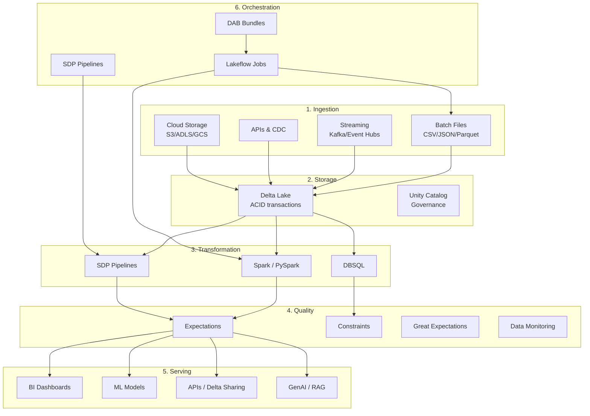
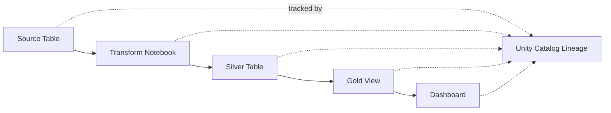
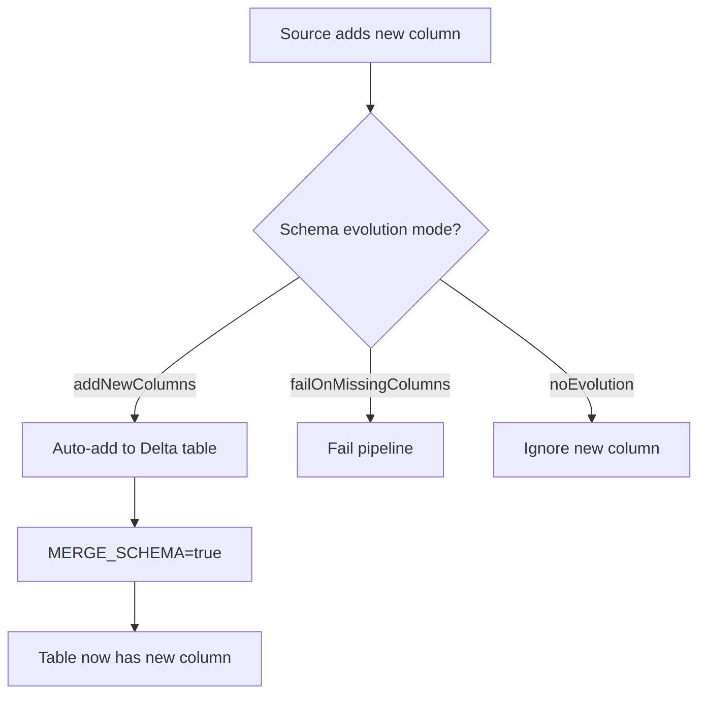

# Data Engineering Concepts — Core Principles

## Overview

This document covers the fundamental concepts every data engineer should understand when building data pipelines on Databricks.

## Component Diagram — Data Engineering Lifecycle



## Key Concepts

### 1. ETL vs ELT

| Approach | Description | Databricks Implementation |
|----------|-------------|-------------------------|
| **ETL** (Extract-Transform-Load) | Transform before loading to storage | Spark jobs that transform and write to Delta |
| **ELT** (Extract-Load-Transform) | Load raw, then transform in-place | Auto Loader → Bronze (raw) → Silver (transformed) |

**Databricks recommendation**: ELT with the Medallion Architecture — load raw data first, then transform progressively.

### 2. Idempotency

A pipeline is **idempotent** if running it multiple times produces the same result without side effects.

```python
# ❌ Not idempotent — duplicates on re-run
df.write.mode("append").saveAsTable("my_table")

# ✅ Idempotent — MERGE handles upserts
df.createOrReplaceTempView("updates")
spark.sql("""
    MERGE INTO my_table AS t
    USING updates AS s
    ON t.id = s.id
    WHEN MATCHED THEN UPDATE SET *
    WHEN NOT MATCHED THEN INSERT *
""")

# ✅ Idempotent — overwrite (for full refresh)
df.write.mode("overwrite").saveAsTable("my_table")
```

### 3. Data Quality

| Tool | When to Use | Severity |
|------|-------------|----------|
| **SDP `@dlt.expect`** | Log warning, keep row | Low severity anomalies |
| **SDP `@dlt.expect_or_drop`** | Drop bad rows, log metric | Source data issues |
| **SDP `@dlt.expect_or_fail`** | Fail the pipeline | Business-critical rules |
| **Delta constraints** | SQL-level CHECK / NOT NULL | Schema enforcement |
| **Great Expectations** | Python library, rich validation | Complex validation suites |
| **Data Quality Monitoring** | Automated drift detection | Production monitoring |

### 4. Lineage



Databricks Unity Catalog automatically tracks lineage across:
- SQL queries, notebooks, and pipelines
- Upstream (source) and downstream (target) tables
- Column-level lineage for SELECT and JOIN operations
- Access via `system.access.table_lineage` and `system.access.column_lineage`

### 5. Incremental vs Full Refresh

| Strategy | Description | When to Use |
|----------|-------------|------------|
| **Full refresh** | Overwrite entire table | Small tables, dimension tables, initial loads |
| **Incremental (MERGE)** | Upsert only new/changed rows | Large fact tables, streaming data |
| **Incremental (CDF)** | Process only changes since last run | CDC pipelines, sync to downstream |
| **Incremental (Auto Loader)** | Process only new files | File-based ingestion |

### 6. Schema Evolution & Management



### 7. Partitioning vs Liquid Clustering

| Strategy | Columns | When | Maintenance |
|----------|---------|------|-------------|
| **Partitioning** | Low cardinality (< 1000 values) | Date columns, regions | Manual OPTIMIZE |
| **ZORDER** | High cardinality filter columns | Join keys, IDs | Manual OPTIMIZE |
| **Liquid Clustering** | Multiple filter columns | New tables, evolving queries | Self-optimizing |

### 8. Stream Processing Patterns

| Pattern | Description |
|---------|-------------|
| **Tumbling windows** | Fixed, non-overlapping time windows (e.g., 1-min metrics) |
| **Sliding windows** | Overlapping windows (e.g., 10-min rolling avg, updated every 1 min) |
| **Session windows** | Dynamic windows based on activity gaps |
| **Watermarks** | Define how late data is accepted before dropping |
| **Deduplication** | Drop duplicate events within watermark window |
| **Stream-static join** | Enrich stream with dimension/lookup tables |
| **Stream-stream join** | Correlate two streams (impressions + clicks) |

## Orchestration Options

```mermaid
graph TB
    subgraph "Lakeflow Jobs"
        J1[Notebook Task] --> J2[Python Script Task]
        J2 --> J3[SQL Task]
        J3 --> J4[Pipeline Task]
        J4 --> J5[If/Else Condition]
        J5 --> J6[Email Notification]
    end

    subgraph "SDP Pipelines"
        P1[Continuous] --> P2[Triggered]
        P2 --> P3[Scheduled]
    end

    subgraph "Declarative Automation Bundles (DAB)"
        D1[Infrastructure as Code] --> D2[CI/CD Integration] --> D3[Environment Promotion]
    end
```



## Best Practices Checklist

- [ ] **Idempotent pipelines** — use MERGE or overwrite, never blind append
- [ ] **Checkpointing** — always use checkpoint locations for streaming
- [ ] **Data quality rules** — at least one expectation per layer
- [ ] **Schema management** — use schema inference with `addNewColumns` for evolving sources
- [ ] **Partitioning** — partition by date or low-cardinality columns only
- [ ] **VACUUM** — schedule regularly to reclaim storage (respect retention)
- [ ] **OPTIMIZE** — schedule file compaction for tables with frequent writes
- [ ] **Lineage** — use Unity Catalog for automatic lineage tracking
- [ ] **Monitoring** — set up alerts for pipeline failures and data quality drops
- [ ] **CI/CD** — use Declarative Automation Bundles for environment promotion