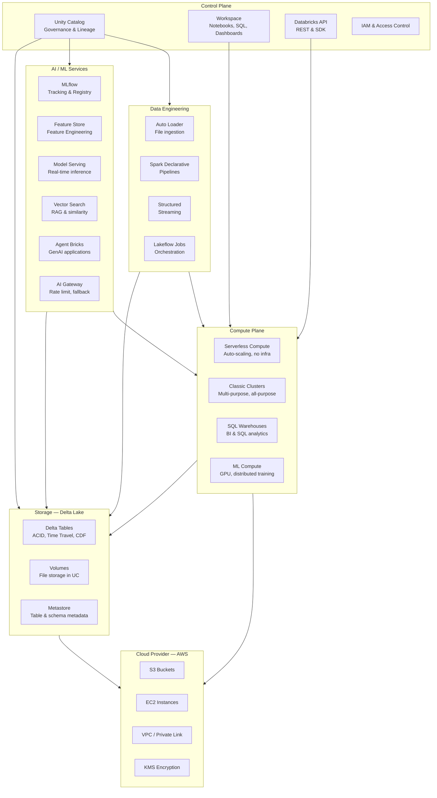
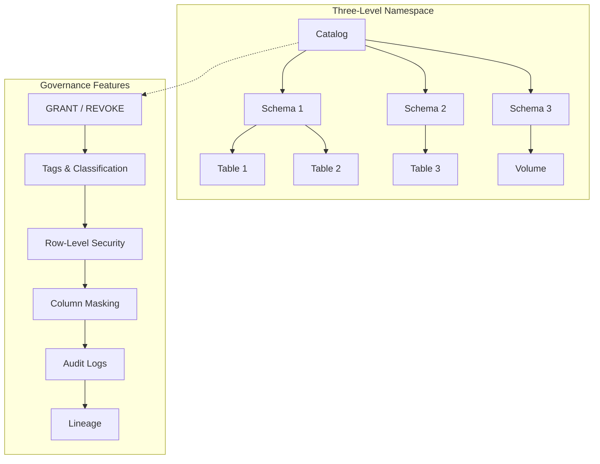
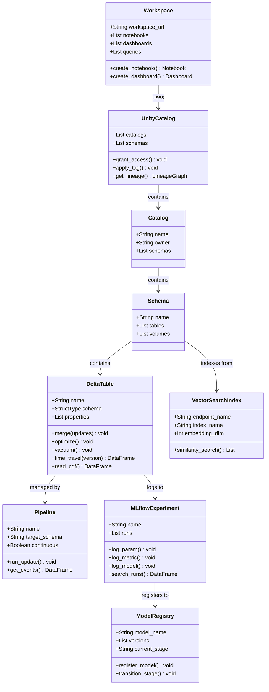
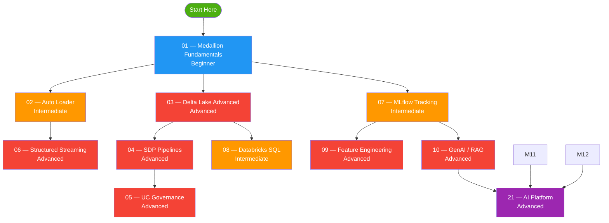

# Databricks Platform Overview

## Architecture — Component Diagram

## Platform Domains

The Databricks Data + AI Platform is organised into 12 domains. Each domain solves a specific problem in the data and AI lifecycle.

### 1. Compute — The Execution Engine

**What it is**: The compute layer runs your code — Spark jobs, SQL queries, ML training, model serving, and notebooks. Databricks abstracts away infrastructure management so you focus on code, not servers. Compute is serverless by default — no cluster configuration needed.

**Key concepts**:

- **Serverless Compute**: Auto-provisioned, auto-scaled, pay-per-use. The default for notebooks, jobs, and pipelines. No infrastructure to manage.
- **Serverless GPU**: GPU-accelerated serverless with the AI base environment (PyTorch, Transformers, PEFT pre-installed). Used for SLM/LLM training and GPU inference.
- **Classic Clusters**: User-managed Spark clusters with custom configurations. Legacy option — serverless is recommended for most workloads.
- **SQL Warehouses**: Compute optimised for SQL queries. Auto-start/stop, integrates with BI tools (Tableau, Power BI, Looker).

**Compute selection**: Serverless for interactive/development, SQL Warehouses for BI/analytics, Serverless GPU for ML training.

**Modules**: All (compute is foundational to every module)

### 2. Data Ingestion — Getting Data Into the Platform

**What it is**: Ingestion moves data from external sources (cloud storage, databases, SaaS applications, message buses) into Delta tables on Databricks. The platform offers both batch and streaming ingestion patterns.

**Key tools**:

- **Auto Loader**: Incrementally and efficiently processes new data files as they arrive in cloud storage (S3, ADLS, GCS). Supports schema inference, schema evolution, and file notification mode. The most common ingestion pattern on Databricks.
- **Lakeflow Connect**: Fully-managed connectors for enterprise applications (Salesforce, MySQL, PostgreSQL, Google Ads, ServiceNow). No infrastructure or code needed — configure in the UI or via DAB.
- **COPY INTO**: Idempotent batch loads from cloud storage. Simpler than Auto Loader but less feature-rich. Good for one-time loads or simple batch.
- **Structured Streaming**: Real-time stream processing from message buses (Kafka, Kinesis, Event Hubs). Supports watermarks, windowed aggregations, and stream-stream joins.

**Choosing an ingestion tool**: Auto Loader for files, Lakeflow Connect for SaaS/databases, Structured Streaming for real-time message buses.

**Modules**: 02 (Auto Loader), 06 (Structured Streaming), 19 (Lakeflow Connect)

### 3. Data Storage — Delta Lake

**What it is**: Delta Lake is the open-source storage layer that brings ACID transactions, schema enforcement, and time travel to your data lake. All tables in Databricks are Delta tables by default — no configuration needed.

**Key features**:

- **ACID transactions**: Serializable isolation level — safe concurrent reads and writes. No more corrupted data from concurrent jobs.
- **Time Travel**: Query data at any historical version or timestamp using `VERSION AS OF` or `TIMESTAMP AS OF`. Enables rollback, audit, and reproducible ML training.
- **Change Data Feed (CDF)**: Row-level change tracking (inserts, updates, deletes). The foundation for CDC pipelines — downstream systems can consume changes incrementally.
- **Schema evolution**: Add columns automatically with `MERGE_SCHEMA` or `addNewColumns` — no manual schema migration needed.
- **Deletion Vectors**: Lazy deletion — faster UPDATE/DELETE without full file rewrites. Enabled by default on new tables.
- **Liquid Clustering**: Self-optimising data layout that adapts to query patterns. Replaces partitioning and ZORDER with a simpler, more flexible approach.
- **OPTIMIZE / ZORDER**: File compaction and data co-location by key. Manual optimisation for read performance.
- **VACUUM**: Remove orphaned files past the retention threshold. Cleans up storage and reduces costs.

**Storage governance**: All tables live in Unity Catalog with a three-level namespace (`catalog.schema.table`). Tables can be managed (UC handles storage) or external (you manage storage).

**File formats supported on Databricks**:

- **Delta Lake** (default): Parquet files + transaction log. ACID, time travel, CDF, schema evolution, deletion vectors. The native format for all managed tables.
- **Apache Parquet**: The columnar file format that Delta builds on. Use for one-time exports, data exchange, or when you only need fast columnar reads without ACID. Supports snappy, gzip, and zstd compression. Predicate pushdown and column pruning built-in.
- **Apache Iceberg**: An open table format (like Delta) from the Apache community. Brings ACID transactions, schema evolution, and snapshot-based time travel to Parquet files. Use when you need multi-engine interoperability (Spark + Trino + Flink + Athena). On Databricks, use **Delta UniForm** — Delta tables with `delta.enableIcebergCompatV2 = true` and `delta.universalFormat.enabledFormats = iceberg` — to generate Iceberg metadata alongside Delta logs. External Iceberg catalogs are accessible via Lakehouse Federation.
- **Apache Avro**: Row-based binary format with JSON schema. Default serialization for Kafka and Confluent Schema Registry. Best for event streaming pipelines where full-row reads and schema evolution matter. Spark supports `format("avro")` for read/write.
- **Apache ORC** (Optimized Row Columnar): Columnar format from the Hadoop ecosystem. Default for Hive and Presto/Trino. Built-in lightweight and heavy-weight indexes for faster reads. Typically achieves better compression than Parquet with snappy. Spark supports `format("orc")`.
- **JSON**: Text-based semi-structured format. Spark infers schema on read (`format("json")`). Supports nested data (arrays, objects). No built-in compression — 5-10x larger than binary formats. Common for APIs, logs, and event ingestion. JSON Lines (NDJSON) is one JSON object per line.
- **CSV**: Text-based flat format. Human-readable, universally supported. No built-in compression. Spark supports `format("csv")` with `header=true` and `inferSchema=true` or explicit schema. Best for data exchange, exports, and ingestion from external sources. Use explicit schema in production for type safety.

**When to use each format**:
| Format | Layout | Compression | Use When |
|--------|--------|-------------|----------|
| Delta Lake | Columnar + log | Built-in | Default on Databricks — all managed tables, pipelines, streaming |
| Apache Parquet | Columnar | snappy/gzip/zstd | One-time exports, data exchange, raw file storage |
| Apache Iceberg | Columnar + meta | Built-in | Multi-engine environments (Spark + Trino + Flink), vendor-neutral |
| Apache Avro | Row-based | snappy/deflate | Kafka, event streaming, schema evolution for pipelines |
| Apache ORC | Columnar | snappy/zlib | Hive/Presto ecosystems, best compression for analytics |
| JSON | Text | None | APIs, logs, semi-structured/nested data, event ingestion |
| CSV | Text | None | Data exchange, exports, human-readable, external source ingestion |

**Module 03 demonstrates all seven formats** with side-by-side comparison: Parquet compression codecs, predicate pushdown, column pruning; Iceberg Delta UniForm snapshots and time travel; Avro row-based read/write; ORC columnar read/write with predicate pushdown; JSON schema inference and type loss; CSV with explicit schema; full 7-format file size comparison (ORC 93 KB \< Parquet 120 KB \< Avro 170 KB \< CSV 426 KB \< JSON 1022 KB); complete format decision guide.

**Modules**: 01 (Medallion Fundamentals), 03 (Delta Lake Advanced)

### 4. Data Governance — Unity Catalog

**What it is**: Unity Catalog is the central governance layer for all data and AI assets on Databricks. It manages who can access what data, tracks lineage, classifies data with tags, and audits all access.

**Key concepts**:

- **Three-level namespace**: `catalog.schema.table` — organises data like a file system. Each level can have different owners and permissions.
- **GRANT / REVOKE**: Fine-grained privileges (SELECT, MODIFY, CREATE, USE SCHEMA, USE CATALOG). Can grant at catalog, schema, or table level.
- **Row-Level Security (RLS)**: Filter rows per user or group. Example: sales reps only see their region's data. Implemented via SQL functions.
- **Column Masking**: Mask sensitive columns (PII, financial data) based on user role. Example: show full SSN to compliance team, masked to others.
- **Tags**: Classify data with key-value pairs (PII=true, sensitivity=high). Used for governance policies, ABAC, and discovery.
- **Lineage**: Visual graph of data flow from source tables through transformations to dashboards. Auto-generated from Spark and SQL queries.
- **Audit Logs**: Every access is logged — who accessed what, when, from where, using what tool. Stored in `system.access` system table.

**What Unity Catalog governs**: Tables, views, volumes, models, functions, catalogs, schemas, storage credentials, external locations, shares.

**Modules**: 05 (UC Governance)

### 5. Data Engineering — Transforming and Processing Data

**What it is**: The data engineering domain transforms raw data into analytics-ready tables using batch processing, streaming, and declarative pipelines. This is the core of the medallion architecture (Bronze → Silver → Gold).

**Key tools**:

- **Apache Spark**: The distributed compute engine. Supports batch DataFrames, SQL, and Structured Streaming. PySpark is the primary API for data engineering on Databricks.
- **Spark Declarative Pipelines (SDP)**: A declarative framework for building data pipelines in SQL or Python. You define what the pipeline should produce (streaming tables, materialised views) and SDP handles orchestration, incremental processing, and data quality expectations automatically.
- **Structured Streaming**: Real-time stream processing with watermarks (for late data), windowed aggregations, deduplication, stream-stream joins, and `foreachBatch` for custom sinks.
- **Delta Lake operations**: MERGE (upsert), CDF (change data feed), Time Travel, OPTIMIZE/ZORDER, VACUUM, deletion vectors.

**Medallion architecture**: The standard data engineering pattern on Databricks:
- **Bronze**: Raw ingested data (as-is from source)
- **Silver**: Cleaned, filtered, deduplicated, enriched
- **Gold**: Aggregated, business-level tables for analytics and ML

**Modules**: 01 (Medallion), 02 (Auto Loader), 03 (Delta Advanced), 04 (SDP), 06 (Streaming)

### 6. SQL Analytics — Querying and Visualising Data

**What it is**: The SQL analytics domain lets analysts and business users query data with SQL, build interactive dashboards, set up automated alerts, and ask natural-language questions — all without writing PySpark code.

**Key tools**:

- **Databricks SQL**: A full SQL editor with views, materialised views, window functions, CTEs, PIVOT, AI functions (`ai_query`, `ai_forecast`), and liquid clustering. Runs on SQL Warehouses (optimised for SQL, not Spark).
- **Lakeview Dashboards**: Interactive BI dashboards with filters, cross-filtering, drill-down, and multi-page layouts. Built on the Lakeview engine — no external BI tool needed.
- **SQL Alerts**: Monitor query results on a schedule and get notified (email, Slack, webhook, Teams) when a condition is met. Example: alert when daily revenue drops below threshold.
- **Genie Agents**: Natural-language Q&A over your data. Users ask questions in plain English and Genie generates SQL, runs it, and visualises results. Data teams curate instructions and example SQL to improve quality.

**AI/BI vs traditional BI**: Lakeview dashboards auto-generate visualisations from data. Genie Agents go beyond fixed dashboards — they answer ad-hoc questions in natural language.

**Modules**: 08 (Databricks SQL), 16 (Dashboards, Alerts, Genie)

### 7. AI / ML — Machine Learning Lifecycle

**What it is**: The AI/ML domain covers the full machine learning lifecycle — from feature engineering to model training, tracking, evaluation, registry, and serving. Databricks integrates with popular ML frameworks (PyTorch, scikit-learn, XGBoost, HuggingFace).

**Key services**:

- **MLflow**: Open-source experiment tracking, model registry, and model serving. Log parameters, metrics, artifacts, and models. Track experiments across runs. Register models in Unity Catalog with version control.
- **Feature Store**: Centralised feature management with point-in-time correctness. Define feature tables in Unity Catalog, create training sets with FeatureLookup, and serve features for real-time inference.
- **Model Training**: Distributed training on CPU or GPU compute. Supports PyTorch, scikit-learn, XGBoost, HuggingFace Transformers. For SLM/LLM fine-tuning, use LoRA/PEFT on Serverless GPU with the AI base environment.
- **Model Serving**: Deploy models as REST API endpoints with autoscaling. Supports real-time inference, batch inference, and serverless (scale-to-zero).

**End-to-end ML workflow**: Data → Feature Engineering → Training (MLflow) → Evaluation → Registry (UC) → Serving Endpoint → Monitoring.

**Modules**: 07 (MLflow), 09 (Feature Store), 11 (End-to-End ML), 22 (SLM Training)

### 8. GenAI — Generative AI Applications

**What it is**: The GenAI domain builds AI applications on top of large language models — retrieval-augmented generation (RAG), vector search, LLM serving, and agent development with governance.

**Key services**:

- **AI Search (formerly Vector Search)**: Index embeddings for semantic similarity search. Auto-syncs with Delta tables. Powers RAG pipelines by finding the most relevant documents for a given query.
- **RAG Pipelines**: Retrieval-augmented generation — ground LLM responses in your enterprise data. Pipeline: chunk documents → generate embeddings → store in AI Search index → retrieve relevant chunks at query time → pass to LLM.
- **LLM Serving**: Serve foundation models (Llama, Mixtral, GPT-4o) via REST API. Pay-per-token. Supports streaming responses.
- **AI Gateway**: Centralised governance for LLM endpoints — rate limiting, fallback (primary → backup model), token logging to Delta tables, guardrails (PII detection, content filtering).
- **Agent Development**: Build custom AI agents with tools, MCP servers, and Unity Catalog functions. Supervisor Agent orchestrates multiple subagents. Genie Agents provide natural-language data Q&A.
- **AI Functions (SQL)**: Call LLMs directly from SQL — `ai_query` (call any LLM), `ai_forecast` (time-series forecasting), `ai_analyze_sentiment`, `ai_classify`.

**RAG architecture**: User question → Embed → AI Search (similarity search) → Retrieve top-k chunks → Augment prompt with context → LLM generates grounded answer.

**Modules**: 10 (GenAI RAG), 21 (AI Platform)

### 9. Orchestration — Scheduling and Automating Workflows

**What it is**: The orchestration domain schedules and automates multi-step workflows — ETL pipelines, ML training jobs, data refresh, and CI/CD pipelines. Lakeflow Jobs is the native orchestrator; DAB provides infrastructure-as-code.

**Key tools**:

- **Lakeflow Jobs**: Multi-task workflows with dependencies (notebook task → SQL task → pipeline task). Supports scheduling (cron), triggers (file arrival, table update), retries, alerts, and conditional logic (if/else, for-each).
- **Declarative Automation Bundles (DAB)**: Infrastructure-as-code for CI/CD. Define jobs, pipelines, and resources in YAML. Deploy across environments (dev → staging → prod) with `databricks bundle deploy`. Integrate with GitHub Actions for CI/CD.

**Job task types**: Notebook, SQL, Pipeline, Python script, DLT pipeline, condition (if/else), for-each, run job, Genie Code task.

**Modules**: 12 (Jobs & DAB), 18 (Git Integration)

### 10. Data Sharing — Cross-Organisation Collaboration

**What it is**: The data sharing domain lets you securely share data with external organisations without copying or moving data — using the open Delta Sharing protocol. Recipients access shared data via a simple download link or by mounting it as a Unity Catalog catalog.

**Key concepts**:

- **Shares**: A collection of tables, notebooks, volumes, or files that you share with one or more recipients.
- **Recipients**: Two types — Open (token-based, works with any platform) or Databricks-to-Databricks (direct UC integration).
- **Providers**: Consume data shared by other organisations. Shared data appears as a Unity Catalog catalog — query it like any other table.
- **Security**: Data stays in your account. Recipients get read access via short-lived tokens. No data copy, no egress costs.

**Modules**: 15 (Delta Sharing)

### 11. App Development — Building Data Applications

**What it is**: The app development domain lets you build and deploy data and AI applications directly on the Databricks platform — no separate infrastructure, no separate authentication. Apps run on serverless compute and integrate with Unity Catalog.

**Key features**:

- **Databricks Apps**: Serverless app hosting with OAuth authentication. Deploy from Git folder or DAB. Auto-provisions compute, handles HTTPS, and scales automatically.
- **Supported frameworks**: Python (Streamlit, Flask, Gradio, Dash), Node.js (React, Angular, Svelte, Express).
- **Use cases**: RAG chatbots, data entry forms, internal tools, interactive dashboards beyond Lakeview, ML model demos.

**Modules**: 17 (Databricks Apps)

### 12. Monitoring and Observability — Platform Health

**What it is**: The monitoring domain tracks platform health, costs, query performance, audit trails, and data quality through system tables — Databricks-hosted analytical tables of your account's operational data.

**Key system tables**:

- **system.billing**: DBU consumption, costs by workspace, compute type, job, and custom tag. Monitor spending and optimise costs.
- **system.compute**: Cluster and warehouse events — start, stop, auto-terminate, runtime, node type. Track compute utilisation.
- **system.access**: Audit log — every API call, notebook run, data access, job run. Answer: who accessed what, when, from where.
- **system.query**: Query history — SQL text, duration, rows returned, errors, user. Identify slow queries and optimise.
- **system.lakeflow**: Job and pipeline runs — status, duration, task results. Monitor pipeline health.

**Data quality monitoring**: Unity Catalog monitors track table freshness, completeness, and data quality metrics. Set up alerts when quality degrades.

**Modules**: 13 (System Tables & Monitoring)

### Domain-to-Module Matrix

| Domain | Modules | Key Skills |
|--------|---------|------------|
| Compute | All | Serverless, GPU, SQL Warehouses |
| Data Ingestion | 02, 06, 19 | Auto Loader, Structured Streaming, Lakeflow Connect |
| Data Storage (Delta Lake) | 01, 03 | ACID, Time Travel, CDF, OPTIMIZE, Liquid Clustering |
| Data Governance (UC) | 05 | GRANT/REVOKE, RLS, Column Masking, Tags, Lineage, Audit |
| Data Engineering | 01, 02, 03, 04, 06 | Spark, SDP, Streaming, Delta MERGE, Medallion |
| SQL Analytics | 08, 16 | SQL, Dashboards, Alerts, Genie Agents |
| AI / ML | 07, 09, 11, 22 | MLflow, Feature Store, Model Serving, SLM Fine-Tuning |
| GenAI | 10, 21 | Vector Search, RAG, LLM Serving, AI Gateway, Agents |
| Orchestration | 12, 18 | Lakeflow Jobs, DAB, CI/CD, GitHub Actions |
| Data Sharing | 15 | Delta Sharing, Shares, Recipients, Providers |
| App Development | 17 | Streamlit, Flask, Gradio, DAB deployment |
| Monitoring & Observability | 13 | System Tables, Billing, Audit, Query History |

## Platform Components

### Compute

| Component | Purpose | Best For |
|-----------|---------|---------|
| **Serverless Compute** | Auto-provisioned, auto-scaled, pay-per-use | Notebooks, jobs, pipelines (no infrastructure management) |
| **Serverless GPU** | GPU-accelerated serverless with AI base environment | SLM/LLM training, GPU inference |
| **Classic Clusters** | User-managed Spark clusters | Custom configurations, legacy workloads |
| **SQL Warehouses** | Optimised for SQL queries | BI tools, dashboards, ad-hoc SQL analytics |

### Storage — Delta Lake

| Feature | Description |
|---------|-------------|
| **ACID transactions** | Serializable isolation level for concurrent reads/writes |
| **Time Travel** | Query data at any historical version or timestamp |
| **Change Data Feed (CDF)** | Row-level change tracking (inserts, updates, deletes) |
| **Schema evolution** | `MERGE_SCHEMA` and `addNewColumns` for evolving schemas |
| **Deletion Vectors** | Lazy deletion — faster UPDATE/DELETE without file rewrites |
| **Liquid Clustering** | Self-optimizing data layout for multi-column filtering |
| **OPTIMIZE / ZORDER** | File compaction and data co-location |
| **VACUUM** | Remove orphaned files past retention threshold |

### Unity Catalog — Governance

### Data Engineering Services

| Service | Description |
|---------|-------------|
| **Auto Loader** | Incremental file ingestion from cloud storage with schema inference |
| **Structured Streaming** | Real-time stream processing with watermarks and windowed aggregations |
| **Spark Declarative Pipelines (SDP)** | Declarative pipeline framework with data quality expectations |
| **Lakeflow Jobs** | Workflow orchestration (notebook tasks, SQL tasks, pipeline tasks, conditions) |
| **Declarative Automation Bundles (DAB)** | Infrastructure-as-code for CI/CD and environment promotion |

### AI / ML Services

| Service | Description |
|---------|-------------|
| **MLflow** | Experiment tracking, model registry, model serving |
| **Feature Store** | Centralized feature management with point-in-time joins |
| **Model Serving** | Real-time inference via REST API endpoints |
| **AI Search (Vector Search)** | Semantic similarity search over embeddings for RAG |
| **AI Gateway** | Rate limiting, fallback, logging, guardrails for LLM endpoints |
| **Agent Development** | Build custom AI agents with tools, MCP servers, Genie Agents |
| **AI Functions (SQL)** | `ai_query`, `ai_forecast`, `ai_analyze_sentiment` in SQL |
| **AI Platform Integration** | Unified pipeline: raw data → ML training → embeddings → RAG → LLM inference → AI Gateway |

## UML Class Diagram — Key Platform Entities

## Compute Selection Guide

| Workload | Recommended Compute | Why |
|----------|--------------------|-----|
| Interactive notebooks | Serverless | Auto-provisioned, no wait time |
| Scheduled ETL jobs | Serverless or Jobs cluster | Pay per use, auto-terminate |
| Streaming pipelines | Serverless | Continuous, auto-scaling |
| SQL analytics / BI | SQL Warehouse | Optimized for SQL, auto-start/stop |
| Model training | ML Compute (GPU) | Distributed training, GPU acceleration |
| Model serving | Serverless | Scale-to-zero, pay-per-request |
| RAG / GenAI | Serverless | Foundation Model APIs are serverless |

## Learning Path — This Repo's Modules

| Level | Color | Modules |
|-------|-------|---------|
| Beginner | 🟦 Blue | 01 — Medallion Fundamentals |
| Intermediate | 🟧 Orange | 02, 07, 08 |
| Advanced | 🟥 Red | 03, 04, 05, 06, 09, 10 |
| Platform Integration | 🟪 Purple | 21 — AI Platform (integrates all) |