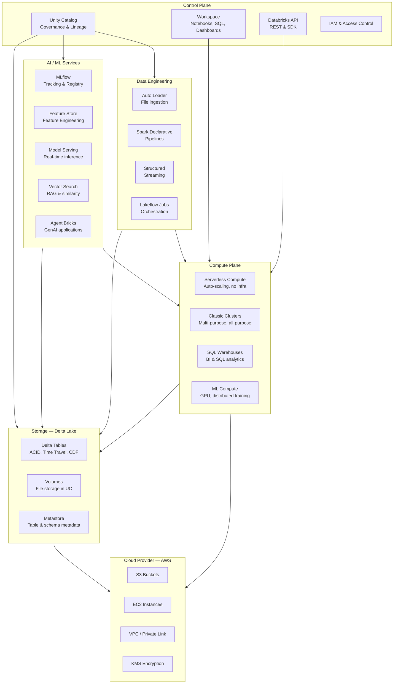
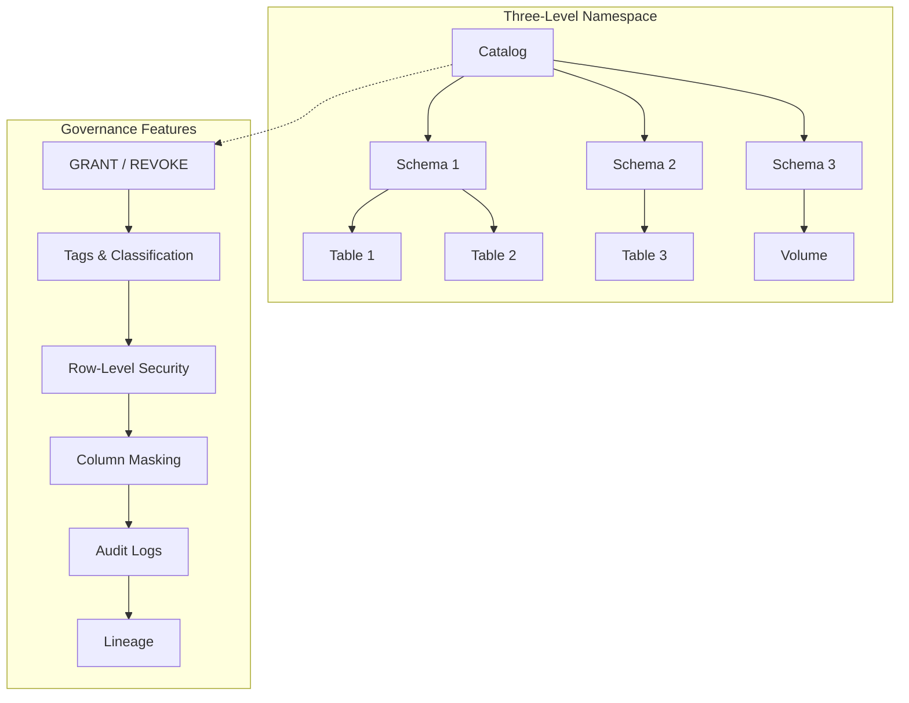
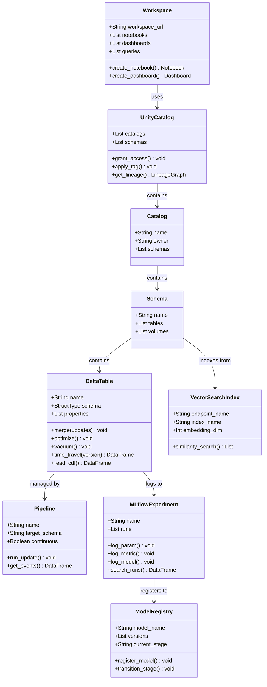
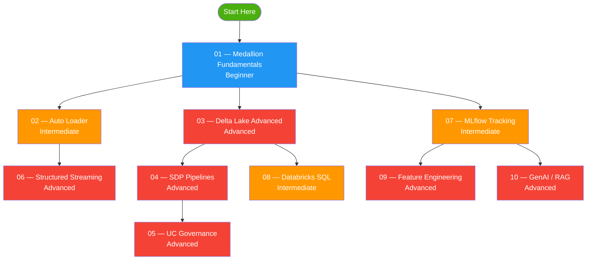

# Databricks Platform Overview

## Architecture — Component Diagram

## Platform Components

### Compute

| Component | Purpose | Best For |
|-----------|---------|---------|
| **Serverless Compute** | Auto-provisioned, auto-scaled, pay-per-use | Notebooks, jobs, pipelines (no infrastructure management) |
| **Classic Clusters** | User-managed Spark clusters | Custom configurations, interactive development |
| **SQL Warehouses** | Optimized for SQL queries | BI tools, dashboards, ad-hoc SQL analytics |
| **ML Compute** | GPU-enabled clusters | Model training, distributed deep learning |

### Storage — Delta Lake

| Feature | Description |
|---------|-------------|
| **ACID transactions** | Serializable isolation level for concurrent reads/writes |
| **Time Travel** | Query data at any historical version or timestamp |
| **Change Data Feed (CDF)** | Row-level change tracking (inserts, updates, deletes) |
| **Schema evolution** | `MERGE_SCHEMA` and `addNewColumns` for evolving schemas |
| **Deletion Vectors** | Lazy deletion — faster UPDATE/DELETE without file rewrites |
| **Liquid Clustering** | Self-optimizing data layout for multi-column filtering |
| **OPTIMIZE / ZORDER** | File compaction and data co-location |
| **VACUUM** | Remove orphaned files past retention threshold |

### Unity Catalog — Governance

### Data Engineering Services

| Service | Description |
|---------|-------------|
| **Auto Loader** | Incremental file ingestion from cloud storage with schema inference |
| **Structured Streaming** | Real-time stream processing with watermarks and windowed aggregations |
| **Spark Declarative Pipelines (SDP)** | Declarative pipeline framework with data quality expectations |
| **Lakeflow Jobs** | Workflow orchestration (notebook tasks, SQL tasks, pipeline tasks, conditions) |
| **Declarative Automation Bundles (DAB)** | Infrastructure-as-code for CI/CD and environment promotion |

### AI / ML Services

| Service | Description |
|---------|-------------|
| **MLflow** | Experiment tracking, model registry, model serving |
| **Feature Store** | Centralized feature management with point-in-time joins |
| **Model Serving** | Real-time inference via REST API endpoints |
| **Vector Search** | Similarity search over embeddings for RAG |
| **AI Gateway** | Rate limiting, fallback, logging for LLM endpoints |
| **Agent Bricks** | Managed GenAI apps (Knowledge Assistant, Supervisor Agent) |
| **Mosaic AI Agent Framework** | Build custom AI agents with tools |
| **AI Functions (SQL)** | `ai_query`, `ai_forecast`, `ai_analyze_sentiment` in SQL |

## UML Class Diagram — Key Platform Entities

## Compute Selection Guide

| Workload | Recommended Compute | Why |
|----------|--------------------|-----|
| Interactive notebooks | Serverless | Auto-provisioned, no wait time |
| Scheduled ETL jobs | Serverless or Jobs cluster | Pay per use, auto-terminate |
| Streaming pipelines | Serverless | Continuous, auto-scaling |
| SQL analytics / BI | SQL Warehouse | Optimized for SQL, auto-start/stop |
| Model training | ML Compute (GPU) | Distributed training, GPU acceleration |
| Model serving | Serverless | Scale-to-zero, pay-per-request |
| RAG / GenAI | Serverless | Foundation Model APIs are serverless |

## Learning Path — This Repo's Modules

| Level | Color | Modules |
|-------|-------|---------|
| Beginner | 🟦 Blue | 01 — Medallion Fundamentals |
| Intermediate | 🟧 Orange | 02, 07, 08 |
| Advanced | 🟥 Red | 03, 04, 05, 06, 09, 10 |