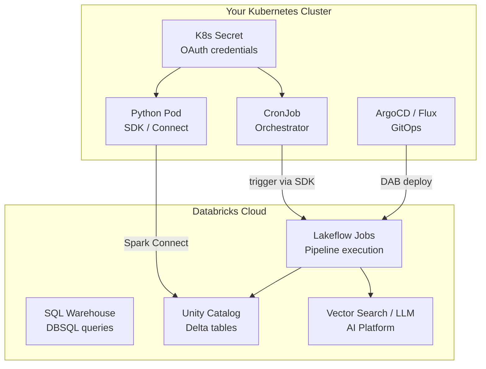

# Kubernetes + Databricks Integration Guide

This document covers running your Databricks data engineering pipeline from a Kubernetes cluster. Three integration patterns are described, with **Pattern 1** fully implemented in the `k8s/` directory.

## Architecture Overview



## Prerequisites

### Databricks Prerequisites

| Requirement | Details | How |
|-------------|---------|------|
| **Service Principal** | OAuth M2M authentication (no PAT tokens) | Account Console → User Management → Service Principals → Add → Generate OAuth secret |
| **OAuth credentials** | `client_id` (UUID) + `client_secret` | Note both values — stored in K8s Secret |
| **Unity Catalog grants** | SP must access all schemas the pipeline touches | `GRANT USE CATALOG, USE SCHEMA, SELECT, MODIFY ON ...` |
| **Lakeflow Job** | The pipeline must be deployed on Databricks | `databricks bundle deploy -t prod` or create in Jobs UI |
| **Serverless compute** | No cluster needed — serverless auto-provisions | Enabled by default in most workspaces |
| **DAB bundle** (optional) | Infrastructure-as-code for the job | Define in `databricks.yml` (see module 12) |

### K8s Prerequisites

| Requirement | Details |
|-------------|---------|
| **K8s cluster** | Any K8s distribution (EKS, GKE, AKS, minikube, kind) |
| **kubectl** | CLI to deploy manifests |
| **Container registry** | Docker Hub, ECR, GCR, ACR, or self-hosted |
| **Network egress** | Pods need HTTPS access to `*.databricks.com:443` |
| **External Secrets** (optional) | External Secrets Operator + Vault for production credential management |

### Python Dependencies by Pattern

| Package | Pattern 1 (Orchestrate) | Pattern 2 (Connect) | Pattern 3 (DAB) |
|---------|:---:|:---:|:---:|
| `databricks-sdk>=0.40.0` | ✅ | ✅ | ✅ |
| `databricks-connect==17.3.*` | — | ✅ | — |
| `databricks` CLI | — | — | ✅ |
| `mlflow` | optional | ✅ | — |
| `pyspark` | — | ✅ (via connect) | — |

---

## Pattern 1: K8s as Orchestrator, Databricks as Compute

**Implemented in `k8s/` directory.**

K8s CronJob triggers and monitors a Lakeflow Job on Databricks. All Spark/ML/RAG execution runs on Databricks serverless — the K8s pod only makes API calls.

### When to Use

- ✅ You already have the pipeline defined as a Lakeflow Job (or DAB bundle)
- ✅ You want K8s as the scheduling layer (CronJob, ArgoCD, or event-driven)
- ✅ You want minimal K8s resources (no Spark, no ML libraries in the pod)
- ✅ You want clean separation: K8s orchestrates, Databricks executes

### Implementation Files

| File | Purpose |
|------|---------|
| [`k8s/trigger_pipeline.py`](../k8s/trigger_pipeline.py) | Python script: OAuth M2M auth → trigger job → poll status → exit with code |
| [`k8s/Dockerfile`](../k8s/Dockerfile) | Lightweight image (Python 3.12 + databricks-sdk only, ~150MB) |
| [`k8s/k8s-secret.yaml`](../k8s/k8s-secret.yaml) | K8s Secret for OAuth credentials |
| [`k8s/k8s-configmap.yaml`](../k8s/k8s-configmap.yaml) | K8s ConfigMap for pipeline config (job name, poll interval) |
| [`k8s/k8s-cronjob.yaml`](../k8s/k8s-cronjob.yaml) | K8s CronJob manifest (namespace, schedule, security) |
| [`k8s/README.md`](../k8s/README.md) | Step-by-step setup guide with troubleshooting |

### Quick Start

```bash
# 1. Databricks: Create service principal + OAuth secret + grant UC permissions
# 2. Build and push the Docker image
cd k8s && docker build -t your-registry/ai-platform-trigger:latest . && docker push your-registry/ai-platform-trigger:latest

# 3. Deploy on K8s
kubectl create secret generic databricks-auth \
  --from-literal=DATABRICKS_HOST='https://<workspace>.cloud.databricks.com' \
  --from-literal=DATABRICKS_CLIENT_ID='<sp-uuid>' \
  --from-literal=DATABRICKS_CLIENT_SECRET='<oauth-secret>' \
  -n databricks-pipeline

kubectl apply -f k8s-configmap.yaml
kubectl apply -f k8s-cronjob.yaml

# 4. Test manually
kubectl -n databricks-pipeline create job --from=cronjob/ai-platform-pipeline-trigger manual-test
kubectl -n databricks-pipeline logs -f job/manual-test
```

### Flow

```
1. K8s CronJob fires at scheduled time
2. Pod starts → reads OAuth credentials from K8s Secret
3. trigger_pipeline.py authenticates via OAuth M2M
4. SDK triggers Lakeflow Job (w.jobs.run_now)
5. All 6 pipeline tasks run on Databricks serverless:
   → Task 1: Ingest raw data (Bronze)
   → Task 2: Clean data (Silver)
   → Task 3: Features + chunks (Gold)
   → Task 4: ML training (parallel with Task 5)
   → Task 5: GenAI prep + embeddings (parallel with Task 4)
   → Task 6: Batch LLM inference
6. Pod polls job status every 30s
7. On completion: pod exits (0=success, 1=failure)
8. K8s records the Job result
```

---

## Pattern 2: Databricks Connect (K8s pod runs Spark on Databricks)

K8s pod runs PySpark code locally, but execution happens on Databricks serverless via Spark Connect protocol. Ideal for custom logic that doesn't map to a notebook task.

### When to Use

- ✅ You need custom Python logic between Databricks calls (e.g., external API calls, custom transformations)
- ✅ You want to run notebook-style code from K8s without a predefined Job
- ✅ You need to run the same code locally (Mac M3 Pro) and in K8s

### Dockerfile

```dockerfile
FROM python:3.12-slim
ENV DATABRICKS_CONNECT_SERVERLESS=1
RUN pip install "databricks-connect==17.3.*" databricks-sdk mlflow scikit-learn pandas
COPY pipeline/ /app/
WORKDIR /app
CMD ["python", "main.py"]
```

### Pod Code

```python
from databricks.connect import DatabricksSession

# Spark session connects to Databricks serverless (no local Spark)
spark = DatabricksSession.builder.serverless().getOrCreate()

# Your pipeline code — executes on Databricks
df = spark.sql("SELECT * FROM demo.ai_platform.gold_customer_features")
print(f"Rows: {df.count()}")

# ML training, embeddings, RAG — all run on Databricks compute
import mlflow
mlflow.set_experiment("/demo/ai_platform_churn")
# ... your module 21 code
```

### K8s CronJob (Pattern 2)

```yaml
apiVersion: batch/v1
kind: CronJob
metadata:
  name: databricks-connect-pipeline
spec:
  schedule: "0 8 * * *"
  jobTemplate:
    spec:
      template:
        spec:
          containers:
          - name: pipeline
            image: your-registry/ai-platform-connect:latest
            envFrom:
            - secretRef:
                name: databricks-auth
            env:
            - name: DATABRICKS_CONNECT_SERVERLESS
              value: "1"
            resources:
              requests: { cpu: "500m", memory: "1Gi" }
              limits: { cpu: "2", memory: "4Gi" }
          restartPolicy: OnFailure
```

### Key Difference from Pattern 1

| Aspect | Pattern 1 (Orchestrate) | Pattern 2 (Connect) |
|--------|----------------------|---------------------|
| **What runs in K8s** | Just API calls (SDK) | PySpark code (via Spark Connect) |
| **Image size** | ~150MB | ~500MB+ (includes Spark client) |
| **K8s resources** | Minimal (100m CPU, 128Mi) | Higher (500m+ CPU, 1Gi+ memory) |
| **Flexibility** | Only triggers predefined jobs | Run any PySpark code interactively |
| **Use case** | Production scheduled pipelines | Custom logic, debugging, development |

---

## Pattern 3: DAB + GitOps (ArgoCD/Flux deploys to Databricks)

Use K8s-native GitOps to deploy DAB bundles to Databricks. Your DAB defines the jobs, and K8s keeps them in sync with Git.

### When to Use

- ✅ Your team uses GitOps (ArgoCD, Flux) for all deployments
- ✅ You want infrastructure-as-code with Git as the source of truth
- ✅ You want automatic deployment on Git push (CI/CD)

### ArgoCD Application

```yaml
apiVersion: argoproj.io/v1alpha1
kind: Application
metadata:
  name: databricks-pipeline
spec:
  source:
    repoURL: https://github.com/Htunn/Data-Engineering.git
    path: .
  destination:
    server: https://kubernetes.default.svc
    namespace: databricks-cicd
  syncPolicy:
    automated:
      prune: true
```

### K8s Job that deploys the DAB

```yaml
apiVersion: batch/v1
kind: Job
metadata:
  name: dab-deploy
spec:
  template:
    spec:
      containers:
      - name: databricks-cli
        image: your-registry/databricks-cli:latest
        command: ["databricks", "bundle", "deploy", "-t", "prod"]
        envFrom:
        - secretRef:
            name: databricks-auth
      restartPolicy: OnFailure
```

### CI/CD Flow

```
1. Developer pushes to Git (main branch)
2. ArgoCD/Flux detects the Git change
3. K8s Job runs: databricks bundle deploy -t prod
4. DAB deploys/updates the Lakeflow Job on Databricks
5. The Lakeflow Job runs on its own schedule (defined in DAB)
6. Pattern 1 CronJob (optional) triggers on-demand runs
```

---

## Comparison Matrix

| Criteria | Pattern 1: K8s Orchestrator | Pattern 2: Databricks Connect | Pattern 3: DAB + GitOps |
|----------|:---:|:---:|:---:|
| **K8s role** | Trigger + monitor | Run Spark code | Deploy DAB bundles |
| **Compute** | Databricks serverless | Databricks serverless | Databricks serverless |
| **Image size** | ~150MB | ~500MB+ | ~100MB (CLI only) |
| **K8s resources** | Minimal | Medium | Minimal |
| **Flexibility** | Low (predefined jobs) | High (any PySpark code) | Medium (DAB-defined) |
| **GitOps native** | ❌ (CronJob-based) | ❌ | ✅ (ArgoCD/Flux) |
| **Custom logic** | ❌ (just triggers) | ✅ (full Python) | ❌ (just deploys) |
| **Recommended for** | Production pipelines | Dev / custom logic | CI/CD teams |
| **Implemented** | ✅ in `k8s/` | Reference only | Reference only |

---

## Security Checklist

- [ ] **Service Principal** created (not using personal PAT tokens)
- [ ] **OAuth M2M** authentication configured (client_id + client_secret)
- [ ] **K8s Secret** stores credentials (not in image, not in ConfigMap, not in Git)
- [ ] **External Secrets Operator** for production (Vault, AWS Secrets Manager)
- [ ] **Unity Catalog grants** scoped to minimum required schemas
- [ ] **Non-root container** (Dockerfile uses `USER trigger`)
- [ ] **Read-only filesystem** (`readOnlyRootFilesystem: true`)
- [ ] **Drop all capabilities** (`capabilities.drop: ["ALL"]`)
- [ ] **Network policy** restricts egress to `*.databricks.com:443`
- [ ] **Resource limits** set on all containers
- [ ] **Audit logging** enabled (system.access.audit for SP activity)

## References

- [Databricks OAuth M2M Authentication](https://docs.databricks.com/aws/en/dev-tools/auth/oauth-m2m/)
- [Databricks SDK for Python](https://docs.databricks.com/aws/en/dev-tools/sdk-python/)
- [Databricks Connect (Serverless)](https://docs.databricks.com/aws/en/dev-tools/databricks-connect/python/tutorial-serverless/)
- [Declarative Automation Bundles](https://docs.databricks.com/aws/en/dev-tools/bundles/index/)
- [Lakeflow Jobs](https://docs.databricks.com/aws/en/jobs/)
- [CI/CD on Databricks](https://docs.databricks.com/aws/en/dev-tools/ci-cd/index/)
- [Unity Catalog Grants](https://docs.databricks.com/aws/en/data-governance/unity-catalog/manage-privileges/)