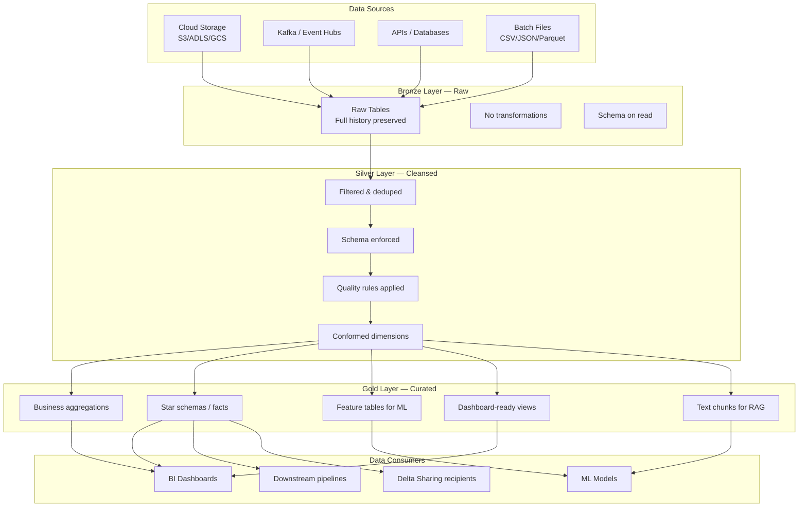
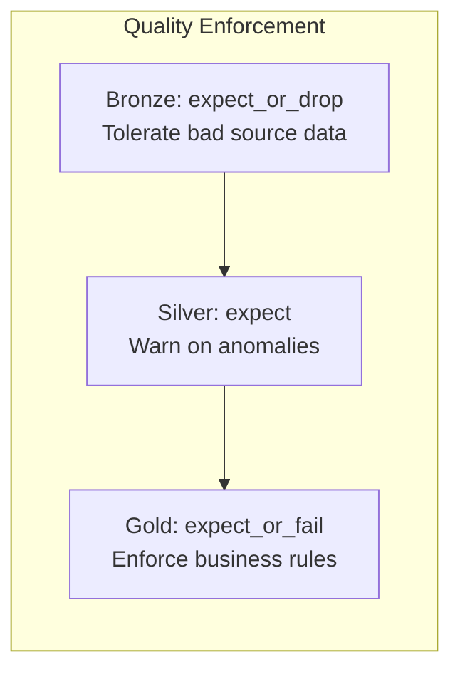
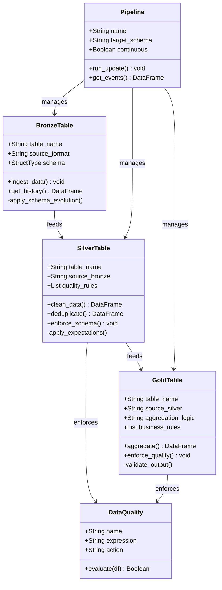

# Medallion Architecture — A Comprehensive Guide

## What is the Medallion Architecture?

The **Medallion Architecture** is a data design pattern that organizes data into three layers of increasing quality and structure:
**Bronze** (raw), **Silver** (cleansed), and **Gold** (curated). It was popularized by Databricks as a best practice for building Lakehouse data pipelines.

The metaphor comes from medals — each layer represents a higher level of refinement, just as bronze, silver, and gold represent increasing purity.

## Component Diagram

## Layer Details

### Bronze Layer — Raw Data

**Purpose**: Capture data as-is from source systems with minimal transformation.

| Aspect | Description |
|--------|-------------|
| **Data state** | Raw, unfiltered, potentially with nulls/duplicates |
| **Transformations** | None — append schema columns only (`ingest_timestamp`, `source_file`) |
| **Storage** | Delta tables, partitioned by ingest date if needed |
| **Ingestion** | Auto Loader (streaming) or batch INSERT |
| **Retention** | Full history — never delete raw data |
| **Use case** | Audit trail, reprocessing, source-of-truth |

**Design principles:**
- Preserve all records including bad data — filtering happens in Silver
- Add metadata columns (ingest time, source file) for traceability
- Use Auto Loader for incremental file ingestion with checkpointing
- Schema inference for unknown source schemas

### Silver Layer — Cleansed & Conformed

**Purpose**: Clean, deduplicate, and standardize data for downstream use.

| Aspect | Description |
|--------|-------------|
| **Data state** | Filtered, deduplicated, schema-enforced |
| **Transformations** | Filter nulls, deduplicate, type casting, derive columns |
| **Quality** | Data quality rules (expectations, constraints) |
| **Storage** | Delta tables with CDF enabled for change tracking |
| **Joins** | Conformed dimensions (lookup tables, reference data) |
| **Use case** | Cross-team sharing, analytics, ML feature engineering |

**Design principles:**
- Apply data quality rules (drop or flag bad records)
- Deduplicate by business key
- Standardize data types and formats
- Enable Change Data Feed for CDC pipelines
- Add derived/derived columns (date parts, categorizations)

### Gold Layer — Curated & Business-Ready

**Purpose**: Provide business-level aggregations and curated datasets for consumption.

| Aspect | Description |
|--------|-------------|
| **Data state** | Aggregated, enriched, business-ready |
| **Transformations** | GROUP BY aggregations, joins, business logic |
| **Quality** | Strict enforcement — `expect_or_fail` on business rules |
| **Storage** | Delta tables, materialized views, or feature tables |
| **Consumers** | Dashboards, ML models, external sharing | (incl. text chunks for GenAI/RAG) |
| **Use case** | Reporting, BI, ML training, API serving, RAG retrieval |

**Design principles:**
- Model for specific business use cases (not generic)
- Create star schemas for BI (fact + dimension tables)
- Create feature tables for ML (with point-in-time correctness)
- Create text chunks for GenAI/RAG (document chunking, embedding-ready)
- Enforce strict data quality — failures should be investigated
- Partition by commonly filtered columns

## Data Quality Tiers by Layer

| Layer | Quality Strategy | Rationale |
|-------|-----------------|----------|
| **Bronze** | `expect_or_drop` | Don't fail on bad source data — tolerate it |
| **Silver** | `expect` | Warn on anomalies — keep data, investigate later |
| **Gold** | `expect_or_fail` | Business-critical — must be correct |

## UML Class Diagram — Medallion Entities

## When to Use the Medallion Architecture

| Scenario | Recommended? | Why |
|----------|-------------|-----|
| New Lakehouse project | ✅ Yes | Industry-standard, scalable pattern |
| Migrating from a data warehouse | ✅ Yes | Progressive refinement from raw → curated |
| Small dataset, single consumer | ⚠️ Maybe | Overkill for tiny datasets — a single view may suffice |
| Real-time alerting | ⚠️ Maybe | Use streaming directly to Gold (skip Silver if latency-critical) |
| ML feature pipeline | ✅ Yes | Bronze/Silver for raw features, Gold for curated feature tables |
| AI Platform (data → ML → GenAI) | ✅ Yes | Gold serves both ML features and text chunks for RAG |

## Common Anti-Patterns

1. **Skipping Bronze** — Direct ingest to Silver loses the raw audit trail
2. **Too many Gold tables** — One per dashboard = maintenance nightmare. Curate for use cases, not individual reports
3. **Complex business logic in Silver** — Silver is for cleaning, not aggregations. Business logic goes in Gold
4. **No quality rules** — Without expectations, bad data flows unchecked to consumers
5. **Overwriting instead of merging** — Use `MERGE` for idempotent upserts, not `overwrite` which loses history
6. **Partitioning on high-cardinality columns** — Creates too many small files. Use Liquid Clustering instead

## Implementation in This Repo

| Module | Layers | Approach |
|--------|--------|----------|
| [01-medallion-fundamentals](../01-medallion-fundamentals/simple_medallion_architecture) | Bronze → Silver → Gold | Simple inline data, `ops` catalog |
| [02-auto-loader](../02-auto-loader/auto_loader_streaming) | Bronze → Silver | Auto Loader + `foreachBatch` + MERGE |
| [04-sdp-pipelines](../04-sdp-pipelines/sdp_medallion_pipeline) | Bronze → Silver → Gold | SDP with @dlt expectations |
| [21-ai-platform](../21-ai-platform/ai_platform_demo) | Bronze → Silver → Gold | Full AI platform: ML features + text chunks for RAG |

## References

- [Medallion Architecture — Databricks](https://www.databricks.com/glossary/medallion-architecture)
- [Lakehouse Architecture](https://www.databricks.com/lakehouse)
- [Delta Lake](https://docs.delta.io/)
- [Spark Declarative Pipelines](https://docs.databricks.com/aws/en/ldp/index/)
- [Apache Parquet](https://parquet.apache.org/)
- [Apache Iceberg](https://iceberg.apache.org/)